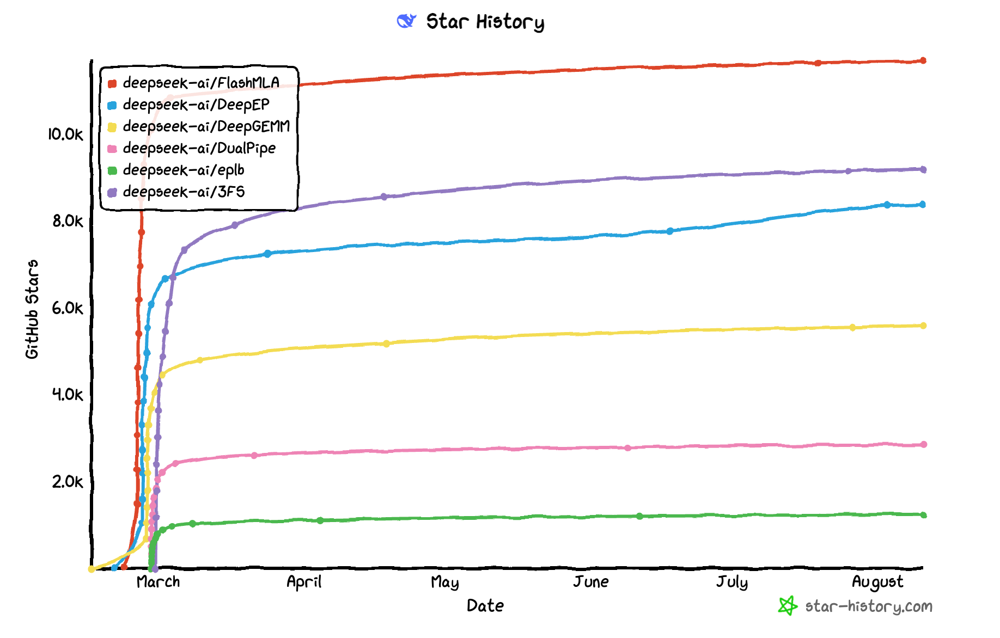
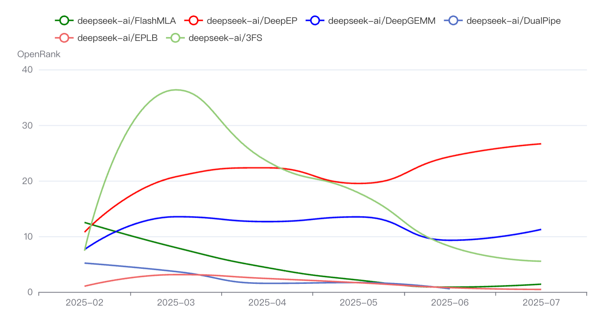
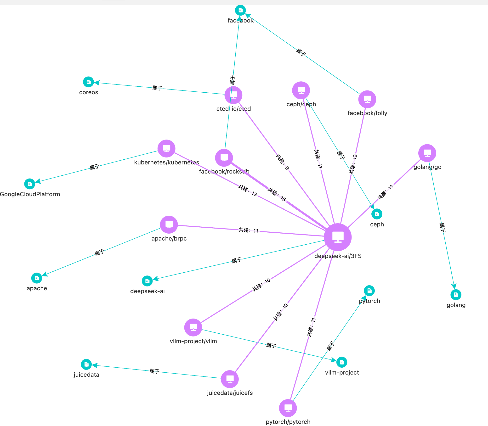
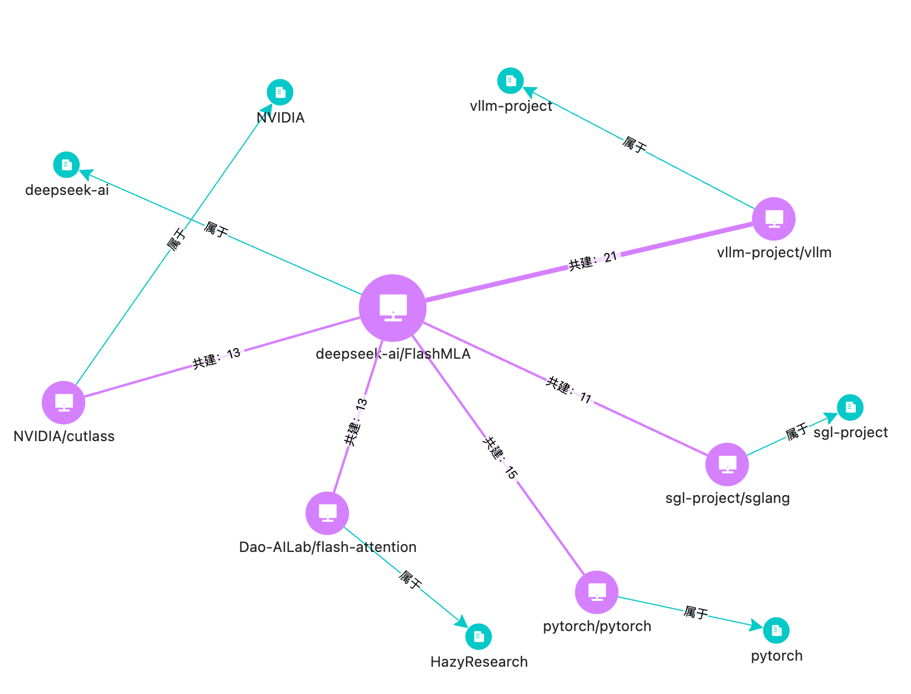
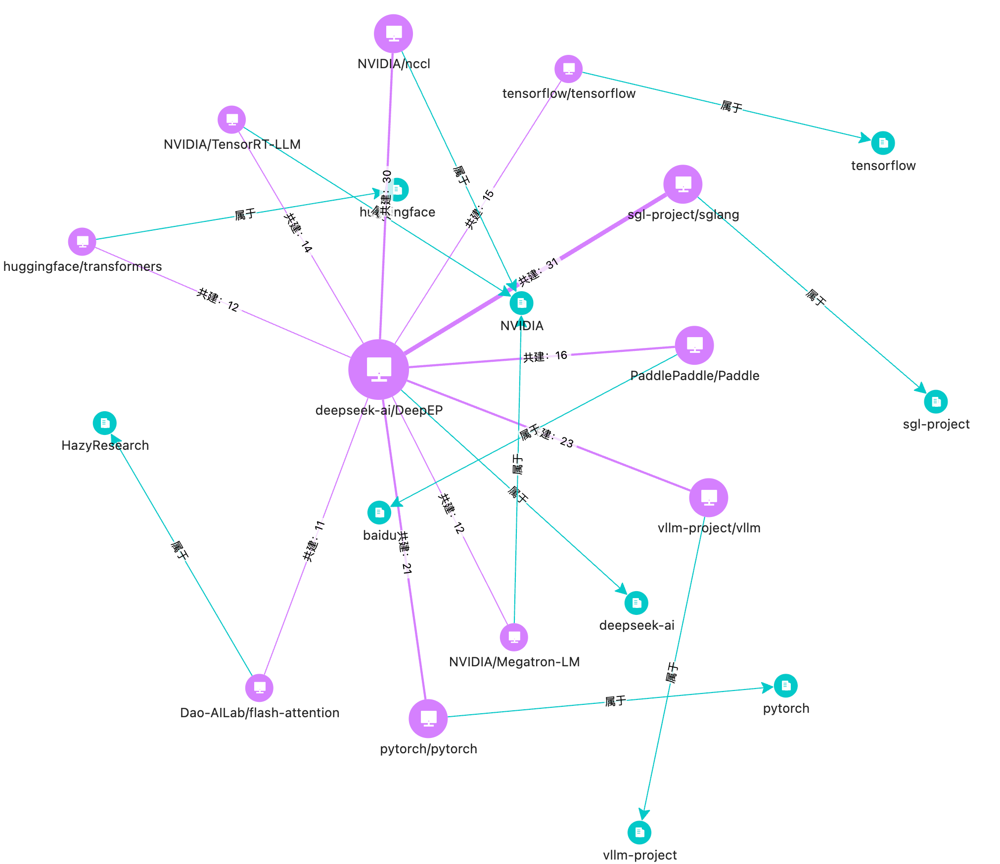
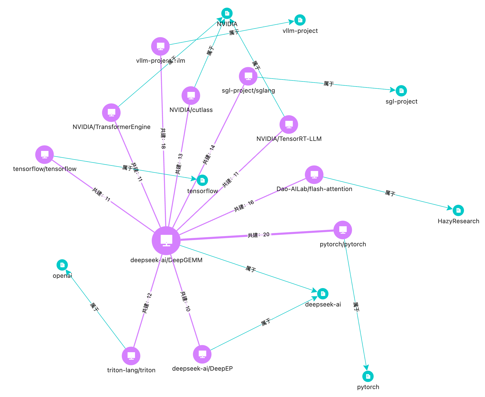

作者：夏小雅，蚂蚁开源
时间：2025-08-10

在 DeepSeek-V3、R1 模型给国内外带来震荡的余波还远远没有消散的时候，DeepSeek 用一周的时间，也就是 2025 年 2 月 24 至 28 日，进行了一场直播式的开源周，将其模型架构的主要模块陆续开源了出来，和社区共享他们在系统和硬件上进行极致优化的实践。在五天的时间里，陆续放出了 6 个仓库，它们分别是：

+ 算子库 FlashMLA：[https://github.com/deepseek-ai/FlashMLA](https://github.com/deepseek-ai/FlashMLA)
+ 通信库 DeepEP：[https://github.com/deepseek-ai/DeepEP](https://github.com/deepseek-ai/DeepEP)
+ 矩阵计算库 DeepGEMM：[https://github.com/deepseek-ai/DeepGEMM](https://github.com/deepseek-ai/DeepGEMM)
+ 并行通信算法 DualPipe：[https://github.com/deepseek-ai/DualPipe](https://github.com/deepseek-ai/DualPipe)
+ 并行负载均衡器 EPLB：[https://github.com/deepseek-ai/eplb](https://github.com/deepseek-ai/eplb)
+ 分布式文件系统 3FS：[https://github.com/deepseek-ai/3FS](https://github.com/deepseek-ai/3FS)

将近半年的时间过去了，这些项目如今发展如何了？我们从社区发展的视角做了一个小小的观察。

### 项目各自的整体发展

（star history：[https://www.star-history.com/](https://www.star-history.com/)）

（OpenRank：[https://open-digger.cn/docs/user_docs/metrics/openrank/](https://open-digger.cn/docs/user_docs/metrics/openrank)）

在那一周里，每一个新项目都是在万众瞩目之下发布出来的，也几乎每一个仓库都是在那一周的时间内完成了 Star 基数的积累。除了最后一天丢出的文件系统 3FS 在更广泛的技术人群画像下再一次引发了火热讨论之外，其他几个仓库现存的 Star 数量和发布的时间顺序呈现有趣的递减，某种程度上，也是吃瓜群众从热切关注到逐渐散去的体现。

直播式开源让 FlashMLA 这样底层的算子库拥有了上万 Star 的关注度，但并不意味着拥有足够健壮的社区。项目从开源后还没有过发版记录，仓库中堆积了 40 多条待解决的 issue，其中鲜少见到来自发布者的回应。而第四天发布的 DualPipe 和 EPLB，更像是一种工程优化实践的分享，而不是长期维护和迭代的软件，仓库内有轻量的算法脚本，在 3 月之后没有过更新。

从社区协作影响力 （OpenRank）趋势来看，DeepEP 和 DeepGEMM 是其中发展尚可的项目，后续的很多数据侧面也体现出这一点。

### 社区维护情况
| **项目** | **维护者** | **Commit** **（最近一次，总数）** | **Issue 维护** **（打开，关闭）** | **PR 维护** **（打开，合入/关闭）** | **PR 贡献者数** |
| --- | --- | --- | --- | --- | --- |
| FlashMLA | [**beginIner**](https://github.com/beginlner) **Jiashi Li@deepseek ** | 8/1，36次 | 45，12 | 0，12/22 | 7位 |
| DeepEP | [**LyricZhao**](https://github.com/LyricZhao) **Chenggang Zhao@deepseek** **（pre ****NVIDIA）** | 8/8，194次 **最近一次更新来自于蚂蚁超算的「建豪」提交的 **[**PR**](https://github.com/deepseek-ai/DeepEP/pull/356) | 95，150 | 15，82/94 | 21位 |
| DeepGEMM | [**LyricZhao**](https://github.com/LyricZhao) | 8/5，140次 | 28，62 | 1，44/65 | 24位 |
| DualPipe | [**beginIner**](https://github.com/beginlner) | 3/10，12次 | 4，7 | 0，6/11 | 5位 |
| EPLB | [**wx-csy**](https://github.com/wx-csy)**** **Shaoyuan CHEN@清华 MadSys** | 3/24，9次 | 7，10 | 1，5/5 | 3位 |
| 3FS | [**SF-Zhou**](https://github.com/SF-Zhou) **DeepSeek AI** | 7/28，72次 | 99，98 | 24，67/96 | 32位 |

可以看到，DeepEP 和 DeepGEMM 都是由 DeepSeek 工程师 **LyricZhao **发布的项目**，DeepEP 由于**社区很活跃，已经引入了新的工程师 sphish 和 LyricZhao 共同响应 Issue、review PR。FlashMLA 和 DualPipe 由 DeepSeek 工程师 beginIner 发布，在发布之后似乎鲜少维护和响应社区。而 EPLB 是清华系统实验室的同学发布的，仓库主体就是一段 python 的脚本文件，更像是一次性发布的实验代码。3FS 是一个相对特别的存在，虽然面向的是大模型训练和负载的场景，但作为一个文件系统，推出时在更广泛的传统存储、云原生、分布式系统领域受到了广泛的关注，贡献群体也更丰富和多样化。

### 来自社区的贡献
###### 完整的 6 个仓库 PR 贡献者及其详细信息可以见下方折叠内容
| developer | repo_name | merged_prs | company | location | email | bio |
| --- | --- | --- | --- | --- | --- | --- |
| interestingLSY | deepseek-ai/FlashMLA | 2 | @deepseek-ai | 中国，浙江省，杭州市 | interestingLSY@gmail.com |  |
| homorunner | deepseek-ai/FlashMLA | 1 |  |  |  |  |
| KnowingNothing | deepseek-ai/FlashMLA | 1 | ByteDance | Beijing | zheng.size@bytedance.com | Time will tell |
| lancerts | deepseek-ai/FlashMLA | 1 | Linkedin | CA | shatang@linkedin.com |  |
| sazczmh | deepseek-ai/FlashMLA | 1 |  |  |  |  |
| sijiac | deepseek-ai/FlashMLA | 1 | Meta - PyTorch | Melo Park | sijiac@meta.com |  |
| yangsijia-serena | deepseek-ai/FlashMLA | 1 | Bytedance | Shanghai, China |  |  |
| A-transformer | deepseek-ai/EPLB | 2 | BIT | Abu Dhabi | cl5743590921@gmail.com |  |
| haosdent | deepseek-ai/EPLB | 1 | Shopee | Singapore | haosdent@gmail.com |  |
| wx-csy | deepseek-ai/EPLB | 1 | Tsinghua University | Beijing, China | chensy20@mails.tsinghua.edu.cn | MadSys@Tsinghua |
| weberxie | deepseek-ai/DualPipe | 2 |  | china | xietingwen@gmail.com | Software Engineer -      Focus on Big Data and Deep Learning. |
| guspan-tanadi | deepseek-ai/DualPipe | 1 |  |  |  |  |
| oraluben | deepseek-ai/DualPipe | 1 | Alibaba | Shanghai |  | Software Testing & Compiler.      Previously @oracle / @graalvm,      @pingcap |
| pojianbing | deepseek-ai/DualPipe | 1 | jike | henan |  | dsdsa |
| vatlor | deepseek-ai/DualPipe | 1 |  |  |  |  |
| LyricZhao | deepseek-ai/DeepGEMM | 4 | DeepSeek AI | Hangzhou, China |  | @deepseek-ai infra; previously at NVIDIA | SenseTime | Tsinghua University. |
| RayWang96 | deepseek-ai/DeepGEMM | 4 | NVIDIA |  |  |  |
| sazczmh | deepseek-ai/DeepGEMM | 3 |  |  |  |  |
| yukuai26 | deepseek-ai/DeepGEMM | 3 |  |  |  |  |
| danthe3rd | deepseek-ai/DeepGEMM | 2 |  |  |  |  |
| zheanxu | deepseek-ai/DeepGEMM | 2 |  |  |  |  |
| A-transformer | deepseek-ai/DeepGEMM | 1 | BIT | Abu Dhabi | cl5743590921@gmail.com |  |
| abcdabcd987 | deepseek-ai/DeepGEMM | 1 | @ppl-ai | Seattle |  | GPG: D5FCB17FD44919C8 |
| acheong08 | deepseek-ai/DeepGEMM | 1 | Huawei | Your computer | acheong@duti.dev | Sleep deprived |
| AcraeaTerpsicore | deepseek-ai/DeepGEMM | 1 |  |  |  |  |
| ademeure | deepseek-ai/DeepGEMM | 1 |  |  |  |  |
| dzhulgakov | deepseek-ai/DeepGEMM | 1 | @facebook |  |  |  |
| fy1214 | deepseek-ai/DeepGEMM | 1 |  |  |  |  |
| fzyzcjy | deepseek-ai/DeepGEMM | 1 | (seriously this is the name) | Solar system |  | "Hello, world!\n" |
| LJC00118 | deepseek-ai/DeepGEMM | 1 |  |  |  |  |
| lucifer1004 | deepseek-ai/DeepGEMM | 1 | @NVIDIA | Beijing, China |  | DevTech Compute @ NVIDIA |
| sleepcoo | deepseek-ai/DeepGEMM | 1 |  | beijing |  |  |
| vatlor | deepseek-ai/DeepGEMM | 1 |  |  |  |  |
| yizhang2077 | deepseek-ai/DeepGEMM | 1 |  | Zhejiang | 1109276519@qq.com |  |
| YLGH | deepseek-ai/DeepGEMM | 1 |  |  |  |  |
| yuxianq | deepseek-ai/DeepGEMM | 1 | NVIDIA | Shanghai |  |  |
| yz-tang | deepseek-ai/DeepGEMM | 1 | @didi | Hangzhou |  | @didi AI Infra; previously at Baidu |
| Z-NAVY | deepseek-ai/DeepGEMM | 1 |  |  |  | An ordinary progarmer. Always be a student. |
| ZeppLu | deepseek-ai/DeepGEMM | 1 |  | Beijing, China |  | alias please=sudo |
| LyricZhao | deepseek-ai/DeepEP | 12 | DeepSeek AI | Hangzhou, China |  | @deepseek-ai infra; previously at NVIDIA | SenseTime | Tsinghua University. |
| sphish | deepseek-ai/DeepEP | 9 | @deepseek-ai | Hangzhou City, China | sy.zhou@hotmail.com | Life Overflow. |
| fzyzcjy | deepseek-ai/DeepEP | 8 | (seriously this is the name) | Solar system |  | "Hello, world!\n" |
| youkaichao | deepseek-ai/DeepEP | 3 | @vllm-project | Beijing, China |  | Ph.D. from Tsinghua University. Core maintainer of @vllm-project . |
| alpha-baby | deepseek-ai/DeepEP | 2 | 蚂蚁 | 杭州 | fujianhao1997@qq.com |  |
| andylin-hao | deepseek-ai/DeepEP | 1 |  |  |  | A developer at InfinigenceAI, working on GPU systems. |
| cywork121 | deepseek-ai/DeepEP | 1 |  |  |  |  |
| dzhulgakov | deepseek-ai/DeepEP | 1 | @facebook |  |  |  |
| GuangguanWang | deepseek-ai/DeepEP | 1 | Alibaba | Hangzhou | guangguan.wang@linux.alibaba.com | |
| guyueh1 | deepseek-ai/DeepEP | 1 |  |  |  |  |
| jeejeelee | deepseek-ai/DeepEP | 1 |  | Chengdu, China | pandaleefree@gmail.com |  |
| phantom5125 | deepseek-ai/DeepEP | 1 |  | Hangzhou / Shanghai / Yokohama | |  |
| ruizhang1230 | deepseek-ai/DeepEP | 1 |  |  |  |  |
| sleepcoo | deepseek-ai/DeepEP | 1 |  | beijing |  |  |
| songhexiang | deepseek-ai/DeepEP | 1 |  | Beijing | songhx@smail.nju.edu.cn | just only know a little C/C++ and network |
| vicoooo26 | deepseek-ai/DeepEP | 1 |  |  |  |  |
| wangfakang | deepseek-ai/DeepEP | 1 | Alibaba | HangZhou | 1031379296@qq.com |  |
| windreamer | deepseek-ai/DeepEP | 1 |  |  |  |  |
| wplf | deepseek-ai/DeepEP | 1 |  | 北京 | 975761915@qq.com |  |
| wzc-wuzhicheng | deepseek-ai/DeepEP | 1 | Alibaba | Shanghai | wzc.wuzhicheng@linux.alibaba.com | |
| ZhiyiHu1999 | deepseek-ai/DeepEP | 1 |  |  |  |  |
| SF-Zhou | deepseek-ai/3FS | 15 | @deepseek-ai | Hangzhou | sfzhou.scut@gmail.com |  |
| huww98 | deepseek-ai/3FS | 5 | Alibaba Cloud @aliyun ACK team @kubernetes | Beijing, China | huww98@outlook.com |  |
| KuribohG | deepseek-ai/3FS | 3 |  |  | zouyuheng1998@gmail.com | |
| yiyuanliu | deepseek-ai/3FS | 3 | Tsinghua University | Beijing, China |  | @deepseek-ai |
| Clcanny | deepseek-ai/3FS | 2 |  | American |  |  |
| izxl007 | deepseek-ai/3FS | 2 |  |  |  |  |
| jojomanar | deepseek-ai/3FS | 2 |  |  |  |  |
| RuixiangMa | deepseek-ai/3FS | 2 | HUST | Hangzhou |  | Build LLM System，Previously at Aliyun | SenseTime |
| SimonCqk | deepseek-ai/3FS | 2 | @alibaba | Hangzhou | cqk0100@gmail.com | The right way or the easy way. |
| symious | deepseek-ai/3FS | 2 |  |  |  |  |
| A-transformer | deepseek-ai/3FS | 1 | BIT | Abu Dhabi | cl5743590921@gmail.com |  |
| bugwz | deepseek-ai/3FS | 1 |  | Beijing |  |  |
| diabloneo | deepseek-ai/3FS | 1 | XSKY | Shenzhen | diabloneo@gmail.com |  |
| echaozh | deepseek-ai/3FS | 1 |  | Hangzhou, Zhejiang, China | |  |
| fourierrr | deepseek-ai/3FS | 1 |  |  | fourierrr@gmail.com |  |
| haochengxia | deepseek-ai/3FS | 1 | UIUC; ZJU | Champaign; Hangzhou | | Later equals never. |
| Huweicai | deepseek-ai/3FS | 1 |  |  | i@huweicai.com | Hello World ! |
| IanBoyanZhang | deepseek-ai/3FS | 1 |  |  |  | Learning to design chips |
| James6xie | deepseek-ai/3FS | 1 | OpenCloudOS & Circle Linux Project | beijing | maxonxie@tencent.com | TencentOS & OpenCloudOS Maintainer；      Founder of Circle Linux Project and Release Engineer |
| jiangxiaosheng | deepseek-ai/3FS | 1 | Carnegie Mellon University | Pittsburgh |  | PhD student at CMU |
| jt-zhang | deepseek-ai/3FS | 1 | @thu-ml, Tsinghua University | Beijing, China |  | A PhD student at Tsinghua University, focusing on efficient training and inference of large models. |
| Kaimary | deepseek-ai/3FS | 1 |  |  | kaimary1221@163.com |  |
| linshier | deepseek-ai/3FS | 1 |  |  |  |  |
| mapleFU | deepseek-ai/3FS | 1 |  | China, Jiangxi Province, Nanchang | maplewish117@gmail.com | So high, so low, so many things to know. |
| Nugine | deepseek-ai/3FS | 1 |  | Internet | nugine@foxmail.com |  |
| r-value | deepseek-ai/3FS | 1 | Renmin Univeristy of China | China | i@rvalue.moe | AFOIer | Τhіnk οncе, сοdе ΝаΝcе; |
| RangerCD | deepseek-ai/3FS | 1 | Kingsoft Office (WPS) | ☁️ | compact-disk@live.com | Senior Backend Engineer at Kingsoft Office (WPS). Previously at Xiaomi / Lotus Cars. |
| wlxiong | deepseek-ai/3FS | 1 |  | Hangzhou |  |  |
| YuqqiZhou | deepseek-ai/3FS | 1 |  |  |  |  |
| yuyuyu101 | deepseek-ai/3FS | 1 | XSKY | Beijing | haomaiwang@gmail.com |  |
| zchrissirhcz | deepseek-ai/3FS | 1 |  | HangZhou, China | zchrissirhcz@gmail.com |  |
| zhaohaidao | deepseek-ai/3FS | 1 |  |  | zhaohaidao2008@hotmail.com | cos(cluster operating system) engineer |

###### 
在这 6 个项目中，统计到有 PR 合入的开发者大约为 90 位。根据开发者自己填写的地理位置信息，有将近一半的开发者（42 位）来自中国。部分开发者会贡献到多个项目中去，例如，来自来自阿布扎比的 A-transformer 同学在 3FS、DeepGEMM 和 EPLB 中分别提交了 1、1、2 个 PR。算子通信库 DeepEP 和矩阵运算库 DeepGEMM 的关联似乎十分紧密：除了项目作者 [**LyricZhao**](https://github.com/LyricZhao)** **之外，还有三位开发者同时在这两个项目中合入了 PR：来自 Facebook 的 dzhulgakov，来自 “太阳系”的 fzyzcjy，和来自北京的 sleepcoo。

以下是填写了公司信息的社区开发者们，可以看看他们都来自于哪些组织：

| **社区开发者** | **贡献项目** | **合入PR** | **公司** |
| --- | --- | --- | --- |
| [<u>huww98</u>](https://github.com/huww98) | deepseek-ai/3FS | 5 | Alibaba Cloud @aliyun ACK team @kubernetes |
| [<u>yiyuanliu</u>](https://github.com/yiyuanliu) | deepseek-ai/3FS | 3 | Tsinghua University |
| [<u>RuixiangMa</u>](https://github.com/RuixiangMa) | deepseek-ai/3FS | 2 | HUST |
| [<u>SimonCqk</u>](https://github.com/SimonCqk) | deepseek-ai/3FS | 2 | @alibaba |
| [<u>diabloneo</u>](https://github.com/diabloneo) | deepseek-ai/3FS | 1 | XSKY |
| [<u>haochengxia</u>](https://github.com/haochengxia) | deepseek-ai/3FS | 1 | UIUC; ZJU |
| [<u>James6xie</u>](https://github.com/James6xie) | deepseek-ai/3FS | 1 | TencentOS &OpenCloudOS & Circle Linux Project |
| [<u>jiangxiaosheng</u>](https://github.com/jiangxiaosheng) | deepseek-ai/3FS | 1 | Carnegie Mellon University |
| [<u>jt-zhang</u>](https://github.com/jt-zhang) | deepseek-ai/3FS | 1 | Tsinghua University |
| [<u>r-value</u>](https://github.com/r-value) | deepseek-ai/3FS | 1 | Renmin Univeristy of China |
| [<u>RangerCD</u>](https://github.com/RangerCD) | deepseek-ai/3FS | 1 | Kingsoft Office (WPS) |
| [<u>yuyuyu101</u>](https://github.com/yuyuyu101) | deepseek-ai/3FS | 1 | XSKY |
| [<u>youkaichao</u>](https://github.com/youkaichao) | deepseek-ai/DeepEP | 3 | @vllm-project |
| [<u>alpha-baby</u>](https://github.com/alpha-baby) | deepseek-ai/DeepEP | 3 | 蚂蚁 |
| [<u>wangfakang</u>](https://github.com/wangfakang) | deepseek-ai/DeepEP | 2 | Alibaba |
| [<u>andylin-hao</u>](https://github.com/andylin-hao) | deepseek-ai/DeepEP | 1 | InfinigenceAI |
| [<u>dzhulgakov</u>](https://github.com/dzhulgakov) | deepseek-ai/DeepEP | 1 | @facebook |
| [<u>GuangguanWang</u>](https://github.com/GuangguanWang) | deepseek-ai/DeepEP | 1 | Alibaba |
| [<u>wzc-wuzhicheng</u>](https://github.com/wzc-wuzhicheng) | deepseek-ai/DeepEP | 1 | Alibaba |
| [<u>RayWang96</u>](https://github.com/RayWang96) | deepseek-ai/DeepGEMM | 4 | NVIDIA |
| [<u>abcdabcd987</u>](https://github.com/abcdabcd987) | deepseek-ai/DeepGEMM | 1 | Perplexity |
| [<u>acheong08</u>](https://github.com/acheong08) | deepseek-ai/DeepGEMM | 1 | Huawei |
| [<u>lucifer1004</u>](https://github.com/lucifer1004) | deepseek-ai/DeepGEMM | 1 | @NVIDIA |
| [<u>yuxianq</u>](https://github.com/yuxianq) | deepseek-ai/DeepGEMM | 1 | NVIDIA |
| [<u>yz-tang</u>](https://github.com/yz-tang) | deepseek-ai/DeepGEMM | 1 | @didi |
| [<u>oraluben</u>](https://github.com/oraluben) | deepseek-ai/DualPipe | 1 | Alibaba |
| [<u>haosdent</u>](https://github.com/haosdent) | deepseek-ai/EPLB | 1 | Shopee |
| [<u>wx-csy</u>](https://github.com/wx-csy) | deepseek-ai/EPLB | 1 | Tsinghua University |
| [<u>KnowingNothing</u>](https://github.com/KnowingNothing) | deepseek-ai/FlashMLA | 1 | ByteDance |
| [<u>lancerts</u>](https://github.com/lancerts) | deepseek-ai/FlashMLA | 1 | Linkedin |
| [<u>sijiac</u>](https://github.com/sijiac) | deepseek-ai/FlashMLA | 1 | Meta - PyTorch |
| [<u>yangsijia-serena</u>](https://github.com/yangsijia-serena) | deepseek-ai/FlashMLA | 1 | Bytedance |

这 32 位开发者的阵容还是非常豪华的，不乏头部厂商和顶尖高校，还有明星项目 vLLM 的核心维护者。其中，7 位来自高校（清华尤多，此外，还有浙大、人大和 CMU 的同学），6 位（实际是 5 位，一位蚂蚁的同学在 GitHub Profile 中填写的还是 Alibaba）来自阿里。在一些具体项目中可以看到部分厂商的集中发力：DeepGEMM 有三位来自英伟达的贡献者，FlashMLA 有两位来自字节的贡献者，3FS 有两位来自分布式存储厂商 XSKY（星辰天和） 的贡献者。**而 DeepEP 有两位来自蚂蚁的贡献者，分别是（**[**<u>alpha-baby</u>**](https://github.com/alpha-baby)**）和（**[**<u>wangfakang</u>**](https://github.com/wangfakang)**），**他们在 DeepEP 中一共合入了 5 条 PR：[#116](https://github.com/deepseek-ai/DeepEP/pull/116)，[#266](https://github.com/deepseek-ai/DeepEP/pull/266)， [#356](https://github.com/deepseek-ai/DeepEP/pull/356)；[#153](https://github.com/deepseek-ai/DeepEP/pull/153)，[#311](https://github.com/deepseek-ai/DeepEP/pull/311)。

****

#### 有哪些值得关注的 PR 和 fork？（贡献内容视角，WIP）
****

### 紧密关联的生态项目们
最后，让我们跟随开发者们的行为轨迹，看看和这些项目紧密关联的生态中还有哪些项目，他们之间又在怎样地产生关联？

（OSGraph：[https://osgraph.com/](https://osgraph.com/)）

| 项目 | 分类 | OpenRank | Star | 创建日期 | 语言 |
| --- | --- | --- | --- | --- | --- |
| [<u>pytorch/pytorch</u>](https://github.com/pytorch/pytorch) | Training Platform | 859 | 92039 | 2016-08-13 | Python |
| [<u>PaddlePaddle/Paddle</u>](https://github.com/PaddlePaddle/Paddle) | Training Platform | 198 | 23102 | 2016-08-15 | C++ |
| [<u>tensorflow/tensorflow</u>](https://github.com/tensorflow/tensorflow) | Training Platform | 39 | 191039 | 2015-11-07 | C++ |
| [<u>NVIDIA/Megatron-LM</u>](https://github.com/NVIDIA/Megatron-LM) | Distributed Training | 27 | 13065 | 2019-03-21 | Python |
| [<u>deepspeedai/DeepSpeed</u>](https://github.com/deepspeedai/DeepSpeed) | Distributed Training | 43 | 39603 |  2020-01-23 | Python |
| [<u>vllm-project/vllm</u>](https://github.com/vllm-project/vllm) | Inference Engine | 637 | 53912 | 2023-02-09 | Python |
| [<u>sgl-project/sglang</u>](https://github.com/sgl-project/sglang) | Inference Engine | 352 | 16555 | 2024-01-08 | Python |
| [<u>NVIDIA/TensorRT-LLM</u>](https://github.com/NVIDIA/TensorRT-LLM) | Inference Engine | 295 | 11219 | 2023-08-16 | C++ |
| [<u>triton-lang/triton</u>](https://github.com/triton-lang/triton) | AI Compiler | 122 | 16380 | 2014-08-30 | MLIR |
| [<u>NVIDIA/TransformerEngine</u>](https://github.com/NVIDIA/TransformerEngine) | AI Kernel Library | 58 | 2598 | 2022-09-20 | Python |
| [<u>Dao-AILab/flash-attention</u>](https://github.com/Dao-AILab/flash-attention) | AI Kernel Library | 22 | 18702 | 2022-05-19 | Python |
| [<u>NVIDIA/cutlass</u>](https://github.com/NVIDIA/cutlass) | AI Kernel Library | 34 | 8169 | 2017-11-30 | C++ |
| [<u>NVIDIA/nccl</u>](https://github.com/NVIDIA/nccl) | AI Kernel Library | 17 | 3911 | 2015-11-14 | C++ |

表格中罗列了反复出现的生态项目，他们同时也收录在我们的[大模型开发生态全景图](https://antoss-landscape.my.canva.site/)上。可以推测，开源周推出的这几个项目在训练平台、分布式训练框架、推理引擎和底层算子库中都有所集成。接下来用几个例子来感受一下社区速度：

+ 2 月 26 日，FlashMLA 发布第三天，开发者向 vLLM 社区提交了添加 FlashMLA 为后端算子库的 [PR](https://github.com/vllm-project/vllm/pull/13867)，并在 28 日成功合入；
+ 2 月 26 日，作为 NVDIA 维护的开源 CUDA 模板库，cutlass 将 [FlashMLA](https://github.com/NVIDIA/cutlass/pull/2135) 和 [DeepGEMM](https://github.com/NVIDIA/cutlass/pull/2137) 添加进它的模板库之中，并陆续支持了多语言的模板；
+ 3 月 3 日，社区开发者 [Hongqing-work](https://github.com/Hongqing-work) 提交 [PR](https://github.com/PaddlePaddle/Paddle/pull/71358)，将通信库 DeepEP 添加到 Paddle 项目中；
+ 3 月 4 日，SGLang 将 FlashMLA、DeepGEMM 和 EPLB 的集成纳入到 [2025 H1 Roadmap](的项目%20Roadmap%20中，) 规划之中，并分别在 3/16、3/10 和 5/24 完成了支持；

DeepSeek 开源周发布的几个项目中，你们最关注的是哪一（几）个项目？后续的项目迭代、社区发展是否符合你们的期待？欢迎评论区留言，谈谈从你们视角的看法。

