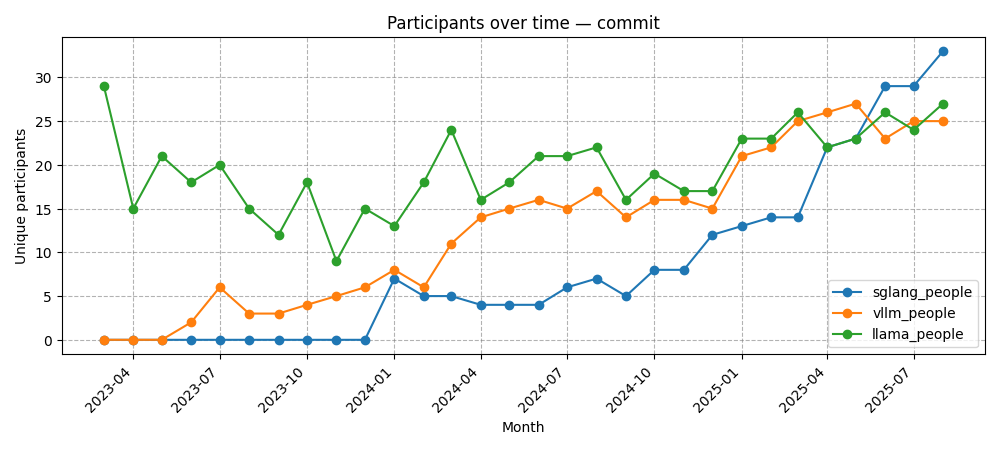
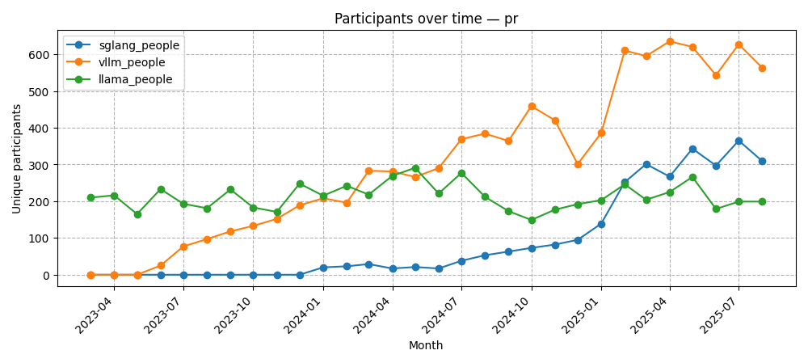
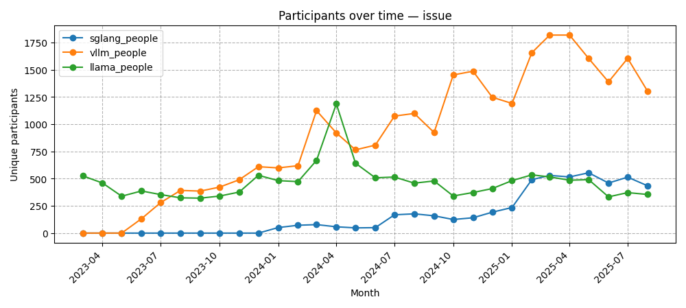
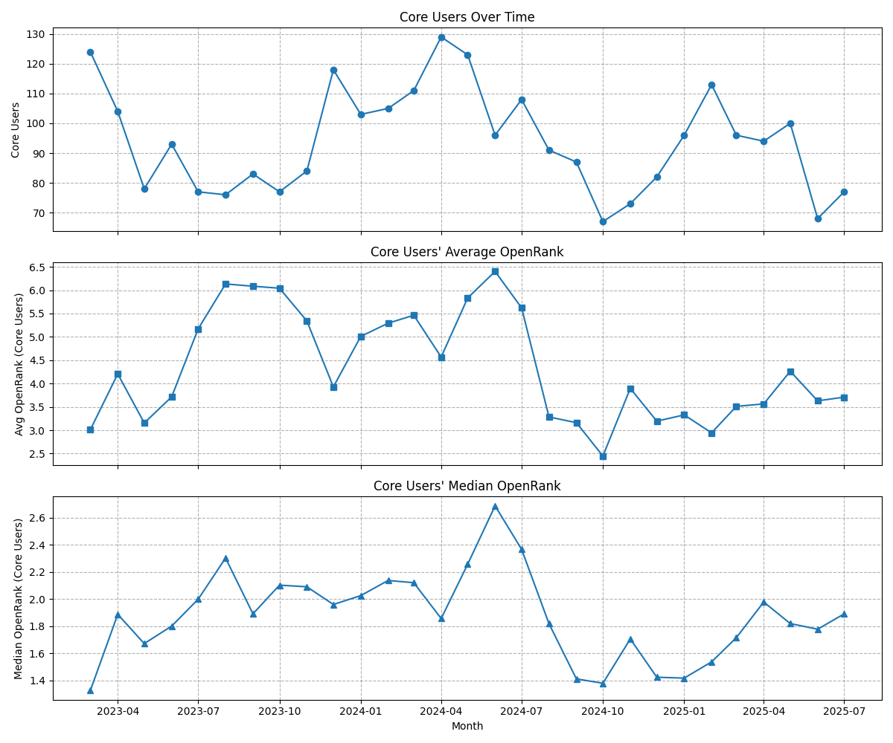
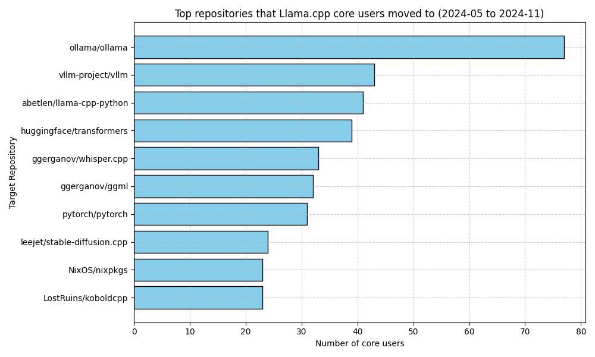
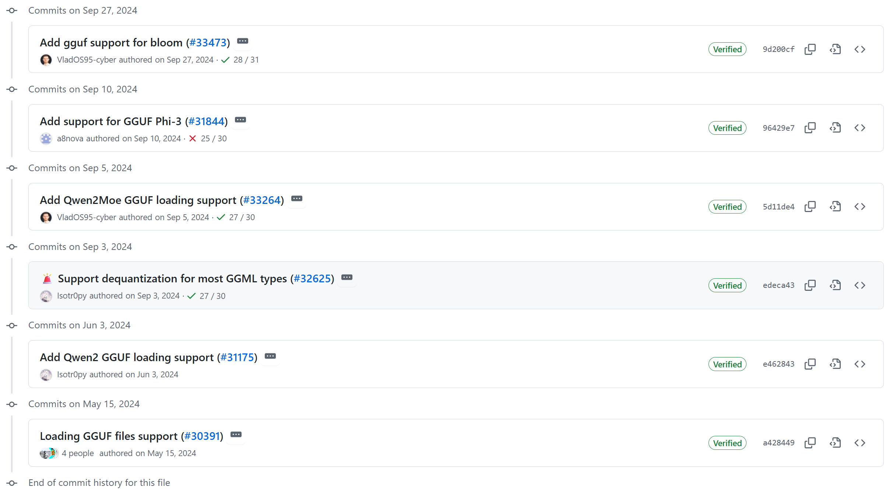
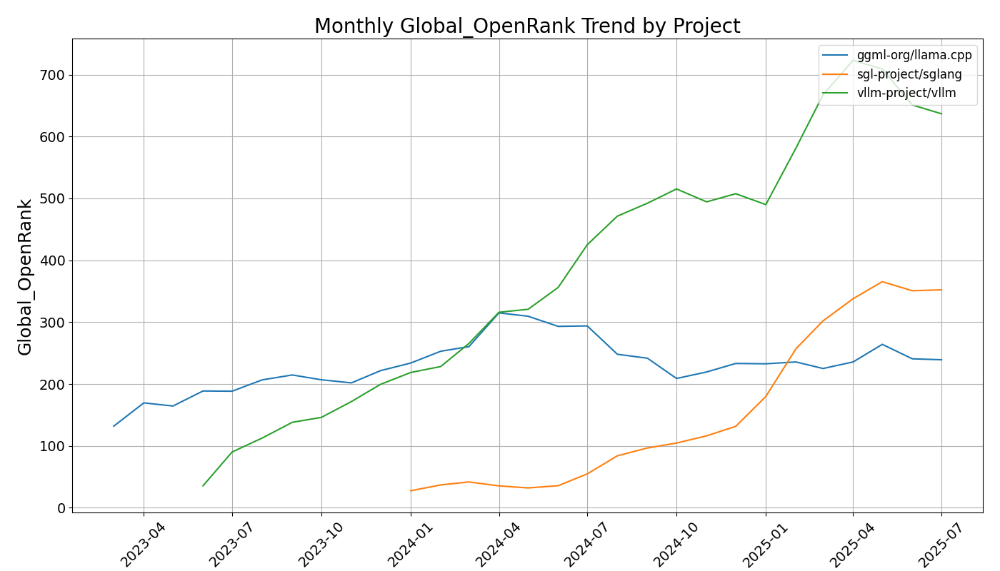
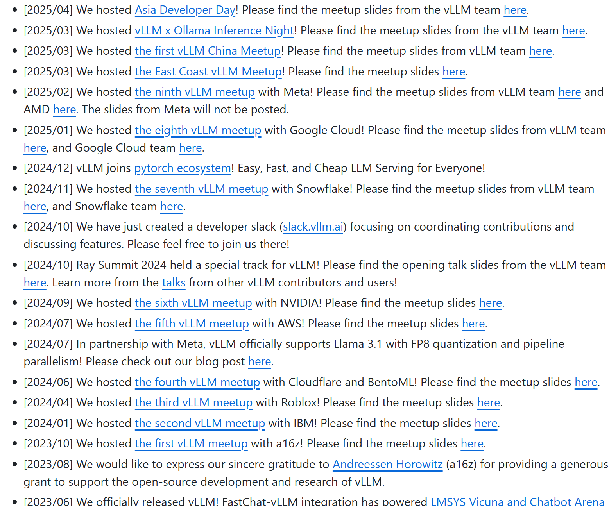

# Llama.cpp: 从单点热度到生态外溢的影响力转型

作者：张震，X-lab 实验室

## 背景：llama.cpp 的崛起与近期变化

llama.cpp 由 Georgi Gerganov 于 2023 年 3 月创建，最初目标是在纯C/C++ 环境中实现 Meta LLaMA 系列模型的本地高效推理，现在已经支持了许多其它类型的大模型。它让开发者在无GPU或轻量硬件（如手机、树莓派）上运行大模型成为可能，并通过多种低比特量化显著降低内存占用。凭借对 CPU/GPU/Metal 等多平台的良好支持与灵活量化策略，llama.cpp 在 2023 年迅速走红，并在 2025 年 8 月累积超过 85,000 个 Star。

图1  Global OpenRank趋势图

然而，如图1所示，2024 年 4 月至 10 月期间，llama.cpp 在 GitHub 社区的 Global OpenRank 出现显著下降；与之相对，vLLM和SGLang新兴高吞吐推理引擎在同一时期热度上升。为何出现这一变化？下文将从**局部人员流向**与**宏观社区发展**两方面进行分析。

## 局部人员流向：骨干稳定、外围扩散

### 1）参与结构的变化

图2  不同行为参与者数量对比

根据图2的实验结果显示，**llama.cpp 的 Commit 参与者总体保持稳定，但 PR/Issue 参与者数量在 2024-04 至 2024-10 明显下滑**。这意味着核心维护力量尚在、功能仍在持续演进，**但外围用户与一般贡献者的注意力发生了明显转移**。

### 2）核心群体收缩

图3  核心群体减少数量和社区openrank值流失情况统计图

以**"每月 Global OpenRank 前 20% 的人员"为核心群体（含用户与贡献者）**，在观察期内该群体规模明显减少。这一变化与项目 Global OpenRank 的下滑高度相关，说明活跃度下降集中体现为高影响力参与者数量的减少。

### 3）核心群体流向

图4  2024/04-2024/10期间核心群体关注的其它仓库统计图

对2024/04–10流失的"核心群体"所参与的其它仓库统计（取最具代表性的前 10 个）结果如图4所示，主要去向为：Ollama、vLLM、llama-cpp-python、Transformers、whisper.cpp、ggml、PyTorch、stable-diffusion.cpp、nixpkgs、koboldcpp 等。这些项目大多围绕 llama.cpp 的技术与生态展开，但定位更贴近具体应用或上层服务，从而吸引了不同类型的开发者：

**· Ollama**：一个构建在 llama.cpp 之上的本地LLM运行框架，提供一站式模型管理与部署体验（跨macOS/Windows/Linux），内置 OpenAI 兼容 API 与 GUI。门槛更低，因而部署与使用类问题更多在 Ollama 社区沉淀，客观减少了 llama.cpp 主仓库的 Issue 量。

**· vLLM**：由UC Berkeley Sky Computing Lab 发起的高性能推理引擎，主打 高吞吐量、多用户并发、长上下文支持，并在 2024 年与 Meta 合作成为 Llama 3/3.1 的首批官方兼容推理框架之一。它引入了 PagedAttention 与 Continuous Batching 等关键优化技术，能大幅提升在 GPU 集群上的推理效率。对比之下，llama.cpp 更擅长单机和本地推理，而在需要 大模型服务化、云端部署 的用户群体中，vLLM 显得更具吸引力。图4的实验数据显示，不少原本活跃在llama.cpp 社区的开发者，也参与到了 vLLM 社区中。这反映了社区"核心群体"中，面向生产环境的用户注意力正转移到vLLM，以满足其在高并发推理和服务稳定性方面的需求。

**· llama-cpp-python**：llama.cpp 的Python 绑定，提供OpenAI 风格接口、与 LangChain/LlamaIndex 的对接、以及本地 Web 服务。2024 年间功能快速补齐（如函数调用、多模型托管、图像输入等），使开发者直接在 Python 生态内完成集成与迭代，相关问题与讨论自然转移到该仓库。

图5 Transformers引入对GGUF格式的支持

**· Transformers**：Hugging Face 的 Transformers库是使用 LLM 的主流工具。如图5所示，2024 年下半年，Transformers 开始支持直接加载 GGML/GGUF 格式的量化模型，这实际上利用了 llama.cpp 的模型格式成果，让用户无需离开 Hugging Face 工具链即可调用已量化的 LLaMA 模型。在这种情况下，用户在HF 工具链内即可调用量化模型，问题反馈会更多出现于Transformers仓库中的议题与讨论。

图6 ggml-org项目组成

**· GGML 库：**如图6所示**，**作为llama.cpp 的底层张量库，2023 年底迁入 ggml-org 组织。许多底层优化（Metal、Intel GPU 等）直接投入 GGML 维护，本就会减少在 llama.cpp 上层的显式活跃度。

**· whisper.cpp / stable-diffusion.cpp / koboldcpp**：与 llama.cpp 同源或同技术栈的项目，分别在语音识别、图像生成、本地写作/多用户交互等场景中迅速积累用户需求。偏应用侧的议题（UI、交互、资源占用、特性集成）更容易在这些仓库汇聚。**这实际上是 llama.cpp 影响力通过下游应用延展的体现：核心开发力量分散到这些更贴近用户的项目上去了。**

综上，llama.cpp 在 2024 年的影响力版图已经从"单点"扩散为"星云"。大量衍生项目（如 Ollama、llama-cpp-python、Transformers、whisper.cpp、koboldcpp 等）承接了不同用户群的需求，使得问题反馈和功能讨论分流到更贴近应用或上层服务的仓库中，导致主仓库的直接参与度下降。但这并不意味着项目失势，而是其技术成果和理念已在更广阔的生态中开枝散叶。同时需要强调，vLLM 并非下游衍生，而是与 llama.cpp 同层定位的推理引擎，它在高并发 GPU 推理与服务化部署方面更具优势，吸引了面向生产环境的开发者，从而瓜分了 llama.cpp 的相对影响力。**因此，2024 年间 llama.cpp 的活跃度下降既是生态外溢的结果，也是同层项目 vLLM 崛起带来的格局变化。**

## 宏观社区发展：性能驱动与宣传引流

从宏观社区发展的视角来看，2024 年中围绕**本地大模型推理的讨论焦点也发生了转移**，这反映了用户选择背后的动机：

图7 reddit话题示例

**· 性能与部署需求驱动选择**：Hacker News 和 Reddit 上多次出现关于_"llama.cpp vs vLLM"_的讨论。例如，如图7所示，Reddit 的投票显示不同用户群体的需求：选择 llama.cpp 的多因其**易用性和低硬件要求**，而选择 vLLM 的多因为**多用户服务能力和 Python 集成方便。**这表明专业用户心态上倾向于根据场景选择工具：**个人离线**则青睐 llama.cpp 或衍生物（追求灵活兼容性），**在线服务**则倾向 vLLM/SGLang（追求极致性能）。这意味着 llama.cpp 不再是所有需求的一家独大方案，用户会根据需求自动分流到更合适的项目。社区中对这种多样化选择持支持态度，认可 llama.cpp 和新引擎各有擅长领域。

**· 长期维护与稳定需求**：尽管高性能引擎在吞吐与并发上更亮眼，但它们对CUDA 版本、Linux 环境等依赖更强，跨系统/多后端适配成本较高。llama.cpp 在 多平台、轻依赖、本地/边缘可用上仍具有独特价值，因而保留了稳定的"本地/离线/嵌入式"用户群体与维护者。

图8 vllm活动列表

**· 宣传方面**：如图8所示，vLLM 更强调宣传和生态运营：举办 meetup、获取资助、建立品牌认知。而llama.cpp 更专注于底层技术实现和跨平台兼容：低调、实用、社区驱动，没有明显的宣传策略。**在舆论层面，这会影响新增用户的注意力分配，部分解释了同区间内****"关注度曲线"的分化。**

综上，从宏观社区发展上看，**llama.cpp 影响力的相对下降，是开源 LLM 工具生态从"一枝独秀"走向"百花齐放"的自然结果**。不同项目找到了自己的定位和用户群：有人需要**极致性能**，于是拥抱 vLLM/SGLang；有人强调**易用性**，则使用 Ollama/KoboldCpp；有人坚持**多平台兼容和自主可控**，仍钟爱 llama.cpp。本质上，这是一种良性的分化，而非零和的此消彼长。

## 结论：表象下降与"外溢式繁荣"

就Global OpenRank 指标 而言，llama.cpp 在 2024/04–10 的相对影响力确实下降。这**既与高并发推理需求增长、服务层工程议题走热有关，也与 vLLM/SGLang 等同层推理引擎的快速崛起直接相关**；同时，**上层封装与并行生态**（如 Ollama、llama-cpp-python、Transformers、GGML、KoboldCpp、nixpkgs 等）**也吸附了大量用户和讨论**，形成了典型的**生态外溢效应**。

就整体生态影响力而言：llama.cpp 的技术成果已经通过多种衍生项目和工具广泛扩散。主仓"热度"被转移且平均化，但内在影响力并未削弱；它从"明星项目"逐渐转向"基础设施"，更像是**成熟后的去中心化与"外溢式繁荣"**。

因此，从整体开源格局看，llama.cpp 的显性影响力下降，但其**隐性影响力依然强大**。既面临同层项目如vLLM/SGLang项目带来的竞争压力，也受益于生态扩散带来的广泛传播。未来，llama.cpp 与 vLLM/SGLang 等推理引擎项目很可能形成互补共生的关系，而非你死我活的竞争：llama.cpp 继续作为多平台本地推理基石与"最易落地"的底座；vLLM/SGLang 等在高吞吐、服务端并发上深耕，承接生产流量。**影响力不再集中于某单一项目本身，而是扩散到整个生态系统，这或许才是开源"大模型推理"领域健康发展的表现。**
