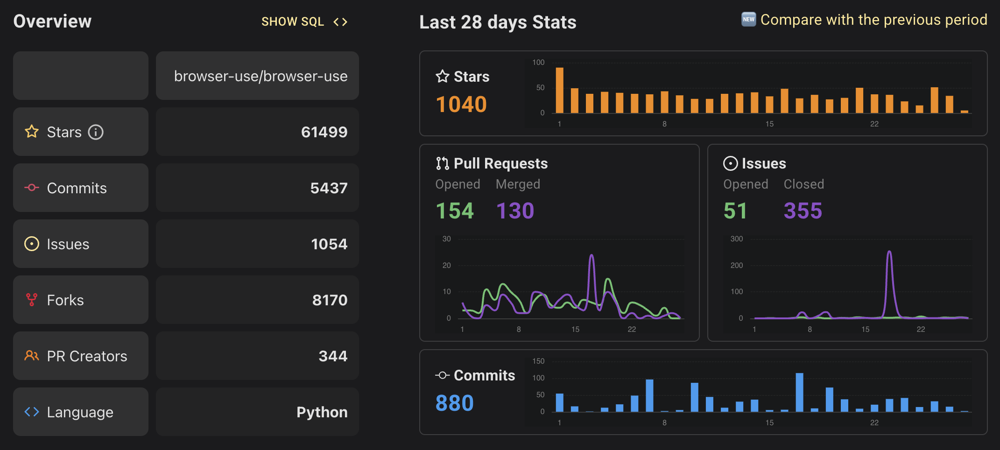
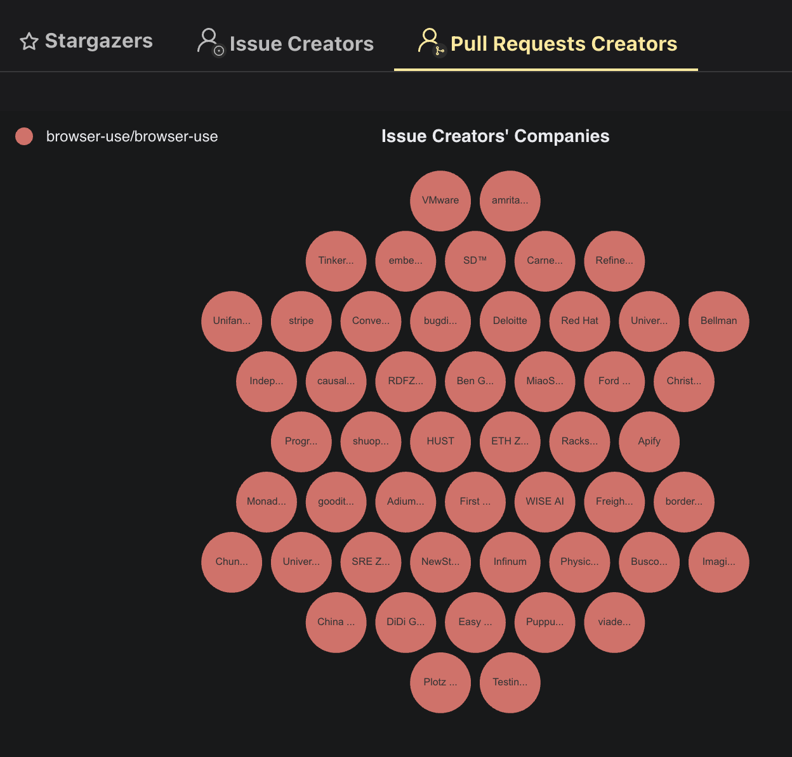
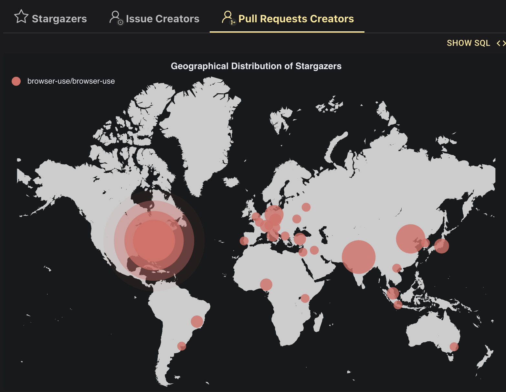
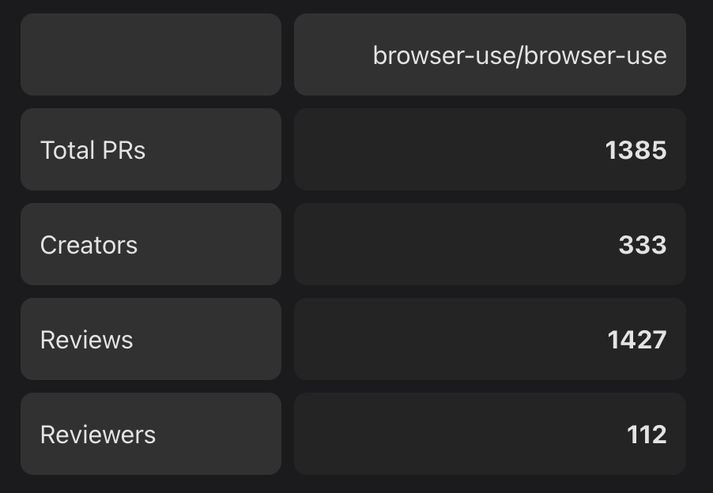
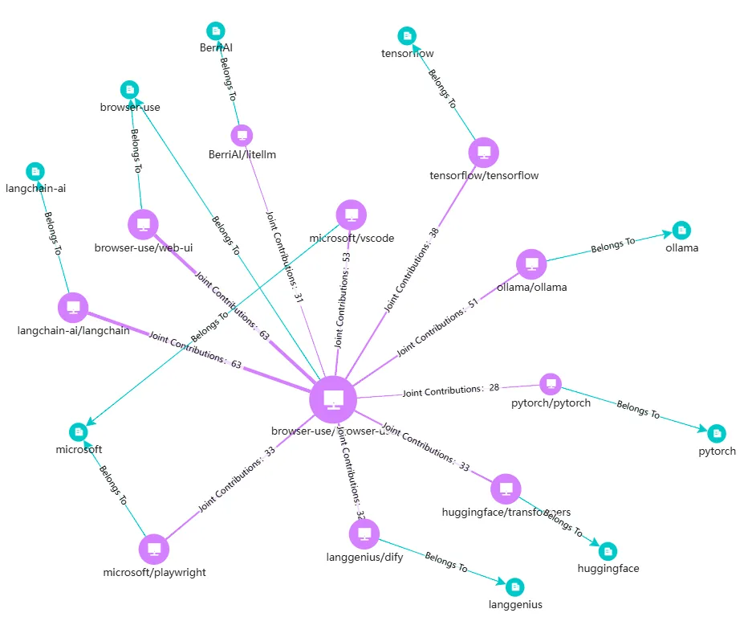

# Browser Use，10 倍杠杆，极速狂奔

# 极速孵化，60K 星的项目是怎么 9 个月炼成的

### 一个加速器中创办的开源项目

2024 年，两位在读硕士 Magnus Müller（数据科学）与 Gregor Zunic 在苏黎世联邦理工学院 **ETH Student Project House（SPH）**加速器完成立项。SPH 是一个为 ETH 内蓬勃发展的创意社区而建的创客空间，以学生的好奇心为基础，激发并培养学生的创客创新思维。该加速器由 ETH 直接运营，为校内学生/博士/博士后团队提供 3–6 个月场地、导师、原型基金（最高 15 万 CHF）以及创业方法论课程。

为什么孵化器看中了 browser-use 这样一个似乎不是很"难"的产品呢？

2024 年底，Anthropic 发布了 MCP，agent 相关领域已经处在了爆发前的沉寂期，而要想做好 agent，需要有强推理能力的模型，一定的记忆管理机制，以及不可或缺的各种各样的工具调用。其中工具调用的部分需要做的事情极其多，**而很多工具也没有很高的技术门槛，很适合社区化的方式打造**。browser-use 就是在这样的 "天时" 出现的项目，它是一个开源的"网络自动化"工具，让 AI agent 能够像真实用户一样操作浏览器，并自动完成设置的动作，如表单填写等。

### 在 Y-Combinator 中获得了极大发展

Browser Use 随后在 2025 年 1 月进入了 Y-Combinator（简称 YC）的 YC25 冬季班，这时候 browser-use 已经开源并且有了近 20K 的 star 关注，2025.2.25 [在 HackerNews 发布](https://news.ycombinator.com/item?id=43173378)，MVP 上线后 4 天即登顶 Hacker News，获得了持续的火爆增长。

值得注意的是，2024 年底 Anthropics 发布了 MCP 协议标准，工具接入模式的简化带来的是智能体 agent 概念的逐渐成熟。而对于智能体来说，好用并且靠谱的工具是稀缺品。Browser Use 作为关键工具的提供方，可以横向为很多 agentic 领域的创业者带来价值。YC25 冬季班里有 20 多家公司都在用 Browser Use 满足自己的需求，直接带来了原始的生态需求和社区贡献。

### 接住了一波通用智能体的流量

2025.3.6 Manus 的爆火发布，直接拔升了通用智能体所受关注的程度，在 MCP 之后，OpenAI 也在 25 年 1 月推出了 Operator，能够自主执行网络任务，但 Operator 所提供的交互能力距离能深度集成 browser 场景还有比较大的差距。Manus 发布的时候，直接内置集成了 browser-use 工具。**成为当红的 agent 项目中 default browser 场景的支持技术**，直接让 browser-use 获得了极高的关注度和持续增长的原始积累。

截止到目前为止，browser-use 积累了 60K+ 的 star，拥有 300 余位提交 PR 的贡献者，每周的活跃度也在持续飙升，这都证明项目在短时间内拥有着旺盛的生命力。

_（10 个月不到的时间，飙升到了极其恐怖的社区数据）_

当然，打铁还需自身硬。除了天时和技术发展趋势所带来的助益，browser-use 也很巧妙地使用了开源来打造一个开放的技术产品，并且目标感很强的选择了开放许可证以及**非常精准的产品定位：就是把 "让 agent 如何优雅的与 browser 交互" **这一件事情做好。

# 核心价值：80% 的行为可以在 browser 里完成

Browser Use 抓住了一个非常精准的产品定位和核心的价值逻辑 —— 如果考虑人类完成日常工作的模式，其实 80% 以上的人类网络行为，是可以在 browser 里完成的。

那么，如果想让 agent 能够更好的完成人类给出的任务，使用 browser 就变成了一项不可或缺的关键技术。而由于各种登录鉴权，网站登录速度等的现实影响，将 browser 的使用做得很可靠，可用，就变成了一项有难度的工程问题。同时由于网站的多样性，每个网站是不是能有效的被发现，被 agent 调用，这当中需要测试和确认的工作非常之多。将 DOM 结构转译为 LLM 友好的纯文本，比纯视觉方案的成本也要更低，稳定性也会更高。

而这样的一种技术产品，**有通用性的需求，开发成本不高但覆盖的面很广，很适合通过开源的方式来急速扩张**。

创始人们在项目开源的时候选择了极其宽松的 MIT 开源许可证，并且将 8000 多行极简代码直接抛入社区，一方面降低了试用门槛，另一方面也降低了贡献门槛，给社区留了很大的发挥空间。这种通过免费开源，带动高频使用，最后通过[托管云服务或 SaaS 的方式](https://www.browserbase.com/)卖钱（公司很快开发了 browserbase.com 形态的可以被集成或直接使用的服务），是之前很多公司跑通过的商业逻辑。

诚然，不可被忽略的一点是 Browser Use 自身产品力也比较过硬，提供了 SOTA 级别的性能表现，例如在 HuggingFace 这些网站上的操作能达到 100% 成功率，而其他场景更多样复杂的网站如 booking.com 等，也能提供不输竞品的相当高的成功率。

由于 browser 的高频使用场景，一个 **"全局够好，部分最优" 的产品，有相当强的吸引力**。

# 社区活跃度及多样性

Browser Use 的开源社区很 "卷"，在 9 个多月的时间里，主项目已经做了 77 个版本发布，并且根据不完全统计已经有了 2000 多个下游项目/使用者。

项目最开始在欧洲苏黎世立项并开源，获得了大量的欧洲本地开发者关注，后来加入 YC 之后在美国也有了不错的发展，社区的开发者分布极其广泛。由于项目极其活跃，如果我们观察体现最深度参与的 PR creators 的分布，会发现贡献者的分布极其分散，这说明了三个问题：

1. 开发者多且复杂，项目发展并不由一些大公司独裁决定；
2. 技术产品形态适合个体开发者自己来贡献，且投入成本能保证低廉，较受开发者青睐；
3. 中国区的 issue 数量较之其他地区有明显的优势，但 PR 数对比起来会少得很明显 —— 在贡献上游这件事情上，我们的开发者依然有着不小的差距；

而开发者社区能持续活跃的另一个关键要素，就是项目本身的"社区驱动"程度。截止到目前为止，**90% 的新模型适配是由社区 PR 完成的，官方给出的平均合并时间 < 24 小时**。

成立之初，browser-use 项目保持了极其夸张的发版频率，半年多的时间内发版了 70 余次，而这种高频发版，与社区自主分不开。目前我们能看到，除了项目本身的贡献者数量巨大（300 余人），项目的 reviewer 也有 100 余人，这就为快速迭代提供了理论上的可能性。

也正得益于此，browser-use 展现了生态类型的技术产品超乎寻常的，通过开源获得的"逃逸速度"，与 browser 技术交互的的技术框架选择也有一些，例如 LaVague https://github.com/lavague-ai/LaVague, Fellou https://github.com/FellouAI/eko 等。其他框架可能有更好的评测分数（例如 GAIA 评分），但这些在生态的巨大差异面前，都暂时不足以动摇 browser-use 的领先地位。

_（项目的 reviewer 多达 100 余人）_

# 使用开源、生态为先 - 快速发展的核心要素

目前智能体运行时（agentic runtime）的定义并没有完全收敛，但我们可以把其想象为[运行智能体的核心引擎](https://google.github.io/adk-docs/runtime/)。智能体作者定义模型和工具，runtime 来处理链接和运行相关的工作。

Browser Use 选择了生态中一个巧妙的定位，一方面，他选择了集中使用已有的开源项目作为自己的上游依赖，这极大降低了开发工作量，可以获得很好的开源社区支持；另一方面，其主动或被动的将自己接入了主流的技术架构，"朋友圈"内全都是 landscape 的上榜项目，如 LiteLLM，PyTorch，Ollama，Dify 等。

Browser Use 选择依靠成熟的 [Microsoft Playwright 社区产品](https://github.com/microsoft/playwright)来搭建自己的能力，Playwright 是一个非常成熟的网络测试和自动化框架，能够很好的与现有的 web 机制进行交互，且通过多年的沉淀，形成了非常可靠稳定的一套工程系统，**生态也非常活跃（23 年的 OpenRank 最高到过 240 左右）**。站在巨人的肩膀上，browser-use 自身所提供的 browser 交互能力就有了很好的质量保障。

此外，browser-use 选择使用 Laminar（同期 YC25 项目）来做可观测性和 AI 产品评估，相互借力发展。Laminar 对 LangChain / OpenAISDK 等已做好了适配，兼容已有事实标准 OpenTelemetry，提供良好用户体验，一行代码就可以对 browser-use 的整个 session 调用链路和过程进行追踪和评估。

browser-use 使用已有的 mem0（landscape 另一上榜项目）来做 LLM 的记忆层服务，分级存储用户信息，管理 RAG 召回等常见场景；agent 侧则是基于 LangChain 构造，主要用到模型调用和 message 管理。

而由于 browser-use 自身的开放和社区属性，其可以通过"被集成"（开源 or 闭源服务）获得极大的发展。首先其可以与 browser 交互服务如 browserbase.com，browserless.io，anchorbrowser.com，steel.dev 等自然集成。而下游产品也大量集成了 browser-use。除了上文提到的 Manus 官方博客确认将其作为默认浏览器操作层，负责点击，填表，截图等所有网页动作，以及 YCW25 内部生态公司间的相互引用，还有其他一些公司和服务集成了 browser-use：例如 WebUI 把 browser-use 封装成了零代码 web 工作台提供给不会写 Python 的运营人员；而 browser-use-mcp-server 则是针对其做了 MCP 协议兼容，让 Claude desktop 用户可以一键把浏览器变成可调用工具。

总之，browser-use 将 "使用开源" 和 "被集成" 做到了极致，这也是他们短时间内能取得快速发展的核心成功原因。

# 开源带来先发优势，逐渐转化商业成功

在官网上，browser-use 将自己定位为 "The AI browser agent"，他们已经从一个 tool 的定位，逐渐走向一个 "最懂 browser 的 agent" 的方向。

如果我们总结一下 browser-use 的成功因素，如下几点一定是最关键的：

1. 充分利用了早期孵化器所带来的地区合作机遇和早期拓客能力，借助开源取得了亮眼的冷启动增长；
2. **生态留白**，通过**精准的产品定位**，将有限的资源花在优化使用体验上，其他部分大量使用开源，借助生态伙伴的力量补全，相互借力，共同发展；
3. 给予社区相当高的自由度和自主权，发挥社区的主观能动性。

我们在 browser-use 的发展上看到了

在最近这些年，我们也看到了不少借助开源获得极快速的冷启动发展，进而将其转化为商业成功的案例，如 Airbyte 和 Grafana 项目在数据领域取得的成功。目前，browser-use 的社区，产品和商业化发展，似乎也走在了类似的这样一条道路上。目前，browser-use 官方已经提供了云服务 https://cloud.browser-use.com/handler/sign-in，将开源所获得的社区关注直接产品化变现。让我们拭目以待这个 "卷王" 还能带来什么样的新惊喜。
