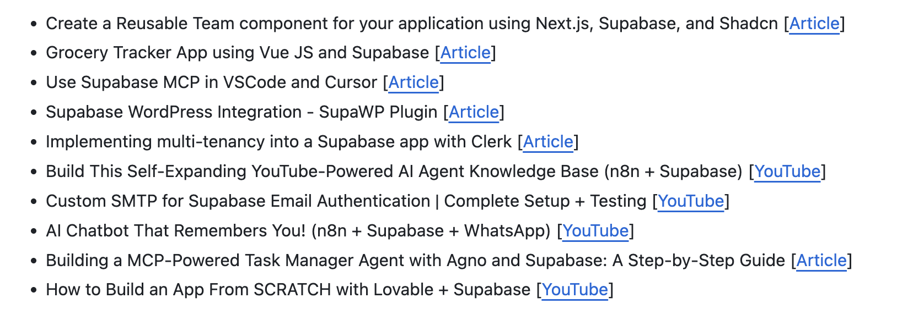
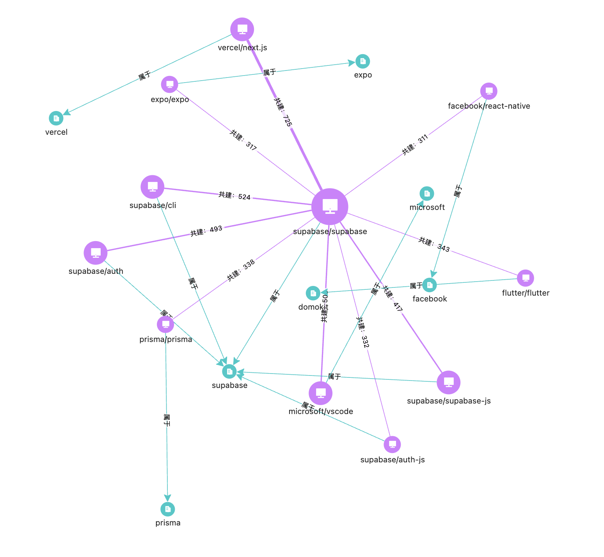
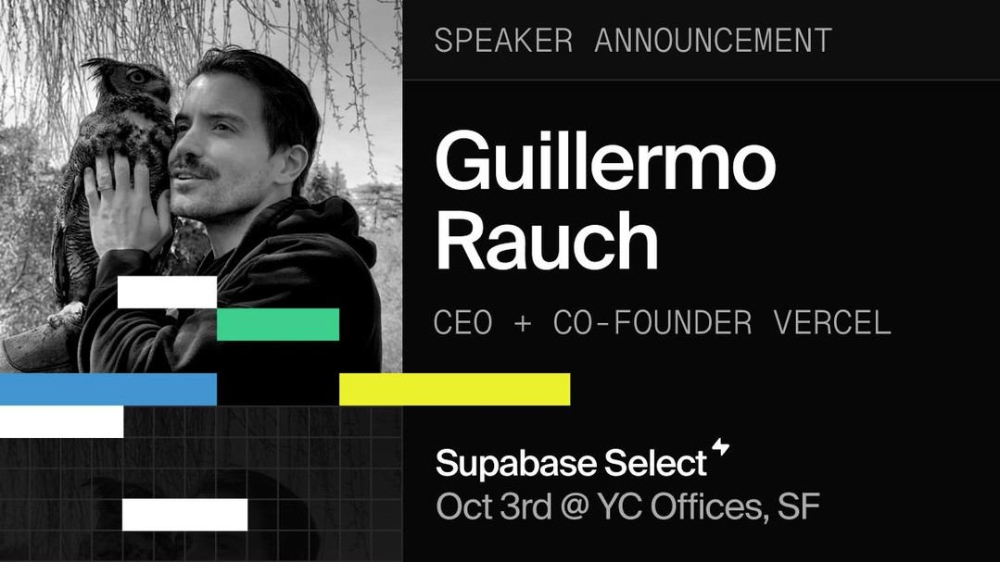
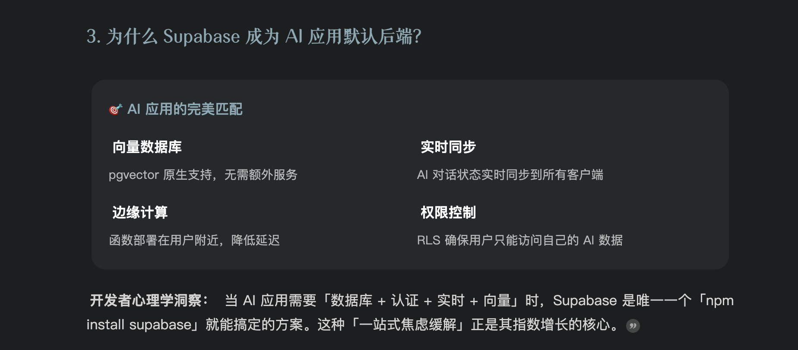
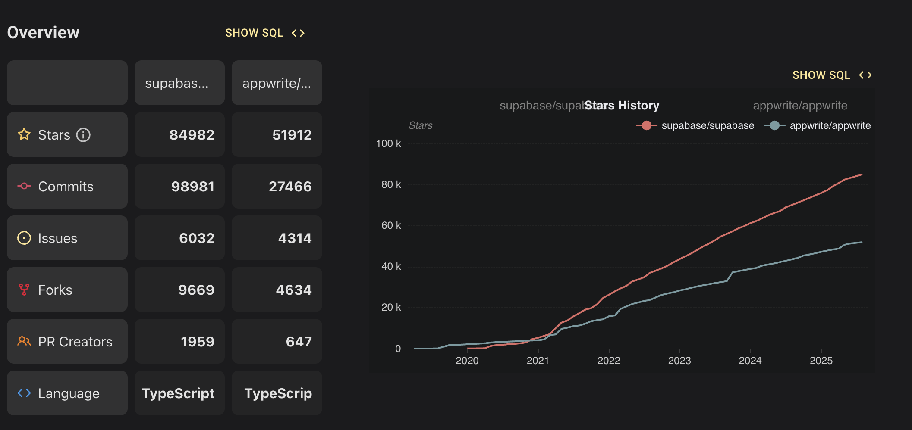

# Supabase，时来天地皆同力

# Backend as a Service，从开源中来，并非为 AI 而生

Supabase 已经成为最成功的开源后端即服务（Backend as a Service，BaaS）平台之一，截止目前（2025.9）实现了 20 亿美金的估值，并管理着超过 650 万个数据库。

不同于很多 GenAI 时代的产品，Supabase 是在 GenAI 时代之前就存在的。项目出发点是做 Google Firebase 的开源替代，在多云时代，通过开源开放生态来挑战一个单一云厂商的闭源服务，从业务逻辑上来说是合理且讲得通的。2020 年到 2022 年，Supabase 也获得了不错的业务发展。

然而，2023 年至今，Supabase 在极短的时间内，从一个后端工具的选择转变为 GenAI 时代技术栈的基石选择。如果从公司整体的发展来看，其成功并非偶然，而是源于清晰的技术战略和三大核心原则。

首先，Supabase 坚定的押注于 PostgreSQL 的稳定性、社区性和可扩展性，这为庞大的开发者社区降低了采用风险，也是企业级服务能成功的基石，是为"人和"；

其次，Supabase 秉持以开发者为中心，收敛的产品哲学，优先考虑生产力、透明度，以开发者为核心用户画像，关注上线速度，减少供应商锁定等潜在的选型卡点，站位准确且不贪心，是为"地利"；

第三，在 GenAI 发展趋势已非常明确时，很坚定的优化产品形态，根据新的开发范式做预判，抓住了几个关键的时间节点，提前做好了准备，是为"天时"。

在天时，地利，人和的加持下，Supabase 以 BaaS 的产品形态，从一个并非为 GenAI 时代而生的产品，一步一个脚印的发展成了如今 AI 研发运维领域，尤其是 AI Coding 和 agentic 智能体产品设计中，最为受欢迎的核心技术选型之一。这是一个励志的故事，也为之后的 AI 领域核心工程项目，尤其是 data agent 和 agentic 平台及运维类型服务，提供了非常好的发展参考。

# 社区带来的"人和"

Supabase 出发点就是为了做 Google Firebase 的开源替代。也因此，走纯粹的开源 + 云的商业路线无可厚非。然而，Supabase 在开源的选择上相当极端，使用了极其宽松的 MIT 许可证，并且项目虽然由商业公司控制，但从第一天开始就用一种社区导向的方式打造开源社区。用公司在 General Availability（GA）正式发布文档中的一句表达：目前 Supabase 所有代码库都使用了 OSI 认证的许可证，并且没有计划在未来做任何改变（当然也可以理解为："在需要改变之前都不用改变"）。

宽松开源许可证，结合 PostgreSQL 生态在过去几年的蓬勃发展，为 Supabase 的社区发展带来了良好的飞轮效应。Supabase 目前的 pull request 中，有 71% 来自社区贡献，仅仅 28% 来自核心团队，这一开源贡献率在属于商业公司，非中立第三方托管的开源项目中，也是较为罕见的。而除了开发者，下游也出现了大量（据不完全统计 2000 余个）基于 Supabase 开源版去做服务的 ISV 或二次开发产品，这也为很多上游公司在做技术选型的时候提供了相当强力的背书。

而 PostgreSQL 的生态也为 Supabase 的发展带来了核心助力，这种选择降低了采用门槛，同时也可以利用现有的 Postgres 强大的工具生态系统，从 Prisma 和 Drizzle 等 ORM，到 pgAdmin，DBeaver 等 GUI 客户端，都可以被自然地纳入生态。作为较为相似的产品定位的直接对比，使用 MariaDB（MySQL 家族）的同样高质量的社区产品 Appwrite，在社区发展的速度，以及开发者整体投入的程度来说，都有着倍数的差距。诚然，除了 PG vs MySQL 之外，这个对比也会涉及到其他因素，但这能给出一个相对确定性的参考是：核心技术会对产品和社区的整体被接受度，带来关键影响。

（来源：https://ossinsight.io/analyze/supabase/supabase?vs=appwrite%2Fappwrite#overview）

除了 PostgreSQL 的核心，Supabase 的产品形态还包含了很多一流的开源工具，比如使用 GoTrue 这一基于 JWT 的 Go 服务器用来做身份验证和用户管理；使用 Storage API 这一与 S3 兼容的对象存储服务巧妙地将文件元数据直接存储在 Postgres 中；以及用 Elixir 编写的 Supavisor 云原生、多租户连接池工具。这个可组合的架构遵循一套强大的「模块化」产品原则：一切皆可独立工作、移植、集成。

这样的模块化架构设计是有非常明确的社区友好性的。直接好处是给社区留下了很大的发挥空间，可以允许开发者选择自己顺手的技术产品；间接好处是这样的架构设计让开发者能意识到，Supabase 所选路径的成功，不可能与开发者体验脱钩，于是他们会有更大的热情来持续贡献。此外值得说明的是，Supabase 公司对开发者和贡献者是相当尊敬和友好的。首先这些年公司通过 Open Collective 向社区做了不少捐赠，展现对贡献者的支持，其次，公司通过开源推进招聘，对于在开源社区能带来贡献的开发者直接发出邀约，多位开源专家是通过招聘获得的。

在 Supabase 每个月发布的 "大事记" 中，我们也能看到他们对 community 社区合作的重视，会将社区合作并交付的案例作为每个月定期发表的关键部分。

（来源：https://github.com/supabase/supabase/issues/38109）

此外，在项目社区的对接和被集成领域，Supabase 作为 BaaS 服务，跟所有的主流的前端开发框架，都提供了兼容的对接形态和翔实的技术文档。我们在项目网络中能清晰看到 Vercel next.js，react-native，Flutter，prisma 等都与 Supabase 有直接的集成，而在 Supabase 的官网上，我们也能看到这种定位的清晰表述。

如果用一句话来表述能，那就是："前端 framework 不管你用哪个，连我们就对了"，就是这么有底气。

（来源：https://osgraph.com/graphs）

而在这当中，Vercel 也对 Supabase 情有独钟。在 2023 年 10 月的 Vercel 年度大会上，随着 Next.js 14 的发布，Supabase 也在发布会上有很多的露脸。而今年的 Supabase Select 会议上，也有 Guillermo Ranch（CEO of Vercel）的演讲和站台。这种相互支持的强 partnership 为 partnership 后来被大量的 AI Coding 工具等采用，提供了非常有说服力的成功案例和参考。

（Source：https://www.threads.com/@supabasecom/post/DOHGPyWinq5/supabase-select-brings-together-the-top-builders-in-the-industryjoin-guillermo-r）

# 开发范式变化带来的"地利"

比起 Firebase 第一代 BaaS 系统和 NoSQL 技术选型，Postgres 为产品带来了 OLTP 场景的核心竞争力，以及进入企业市场的产品战略切入点。

大型组织对关系型数据库有着数十年的投资和信任，**而 PostgreSQL 兼容为这些大客户极大降低了采用风险**，允许这些企业在已有的 PG 兼容的数据平台上，使用 Supabase 提供更现代的开发层。通过这种方式先作为技术核心被选中，之后逐步增加 OLAP 场景，以及 SOC2、HIPAA 等合规认证等企业级功能，这种land and expand（先切入后拓展）的方式让技术选型和采购决策变得更自然，更可持续。

值得一说的是，当 Supabase 成立时提出作为 "Firebase 的开源替代" 并拥抱 Postgres 生态这一精准定位之后，极大地点燃了开发者的热情，其托管的数据库三天内从 8 个加到了 800。

Supabase 为大企业提供了一种风险较低的替代选择。而对于个人开发者和小型公司，在技术选型中所关注的核心是成本、上线速度，以及可拓展性。于是 Supabase 在 2021 年就提出了 **"Build in a weekend, scale to millions"** 这样很精准的定位开发者的口号。一方面极大简化了后端管理，让传统数据库搭建过程中的鉴权，数据库管理，服务器配置这样的辛苦并且容易出错的工作被极大简化；其次，提供了多种方便使用的界面工具如 Table Editor 等，提供类似 Excel 体验，允许用户不用编辑 SQL 也可以直接与数据库交互；此外 "快速启动" 也是非常关键的一个 feature，能够在几分钟之内就拉起一个完全可用的数据后台。这种开发者友好，上线快的 BaaS 类型服务很快就被大量个人开发者，或者技术人员有限的初创公司所青睐。

—— 而这种青睐很重要，为什么？因为小企业早期的技术选型，尤其是核心数据库的选型，会成为未来一段时间在碰到下一个数据瓶颈之前的稳定态。这就让 Supabase 拿到了一个很好的面向未来的站位，可以跟这些公司一起成长。

当然，这种先发优势，并不一定能被持续巩固。因为，在比较传统的技术栈中，现有的架构师会优先考虑那些同样有着广大开发者社区的中间件系统，结合业务侧的前端需求，来应对未来的各种扩容和业务发展的潜在挑战，BaaS 的方式由于成本考量，或者可迁移性等因素，并不是特别主流。

然而，GenAI 发展，AI IDE 如 Cursor 等的流行，以及后续 vibe coding 这一开发范式的出现，极大点燃了原本不是开发者的新时代 GenAI builder 的热情，也为 Cursor，Replit，Bolt.new，Lovable 等 AI IDE 和 Coding 产品带来了疯狂的增长机会。而对于这样的用户画像来说，vibe coding 最需要的，**一是高质量且有品位的前端体验，二是能提供稳定服务并且尽可能简单（降低理解成本）的可靠后端**。Supabase 原本可能的劣势（前后端基本直连，极简技术栈），在这样一个追求创意和开发速度的时代，忽然变成了一种很大的优势。

不仅仅是之前的"缺点" 随着这种开发范式的变化变成了优点，Supabase 早期的一些关键社区开放性设计和产品细节，如「开放元数据」，在开发范式变化的过程中也进一步放大了优势。所谓开放元数据，指的是将几乎所有应用和系统的 metadata 元数据，不是隐藏在不透明的专有服务层中，而是做成标准的、可访问的 Postgres 表各种。例如 Supabase 将用户身份信息 `auth.users`表暴露出来，允许开发者使用熟悉的 SQL 以及 RLS 行级安全策略等方式来直接交互，这种透明度带来了深厚的开发者信任，并实现了封闭系统所无法达到的可扩展性。社区里有很多这样的例子，比如基于 `auth.users` 创建触发器，从而在用户注册时自动填充 `profiles`表

而这种元数据结构化、开放可被查询的设计，在 AI 原生开发工具的场景中尤为关键。对于 Cursor 等工具来说，相关元数据可见能让工具对应用的数据库模式有个准确的理解，从而生成更精确和具有上下文感知的代码，也会带来更好的用户体验。因此，开放元数据这一产品决策，让其成为了 AI Coding 及 agent 时代理想的结构化数据层服务。

于是，先发者的优势，在这过程中，与开发范式的变化一起，被进一步的巩固了。

# 很有前瞻判断力的"天时"

虽然但是，如果仅仅是靠产品定位，并不能很好解释 Supabase 究竟是怎么借助 Lovable 等爆款拿到这一波 "泼天的富贵"的。核心在于，Supabase 几乎是在最正确的时间做了最正确的事情，这种产品的 "前瞻性" 体现了决策团队的技术产品品味，以及对于技术成熟度的准确把控。

+ 23 年接入 PGVectors 和整个 vector embedding 使用场景
+ 24 年借助面向 agent 布局的 tool-use 能力很好的占据了"数据处理"的这个入口
+ 25 年借助 vibe coding 以及 AI IDE 的快速发展拓展了先发优势

于是，当 Agentic 应用提供商如 Lovable 启动他们的技术设计的时候，他们惊奇地发现，已经有了一款 BaaS 服务等在了那里。从 Vercel v0，到 Bolt.new，到 Lovable，传统的后端 + 中间件较为厚重，模型自身也缺乏这方面的编程能力，而 Supabase 提供了一个开放，可拓展，拥有 database 核心能力，以及大量数据中间件能力（如 Authing，Edge functions and Vectors），让 agent 开发者可以"开箱即用"，极大地减少了技术选型困难和运维消耗。

综合回顾一下，Supabase 的核心成功因素，来自三次非常有前瞻性的"敢为人先"。

## （1）Vector！Vector！Vector！

（题目来自于 Steve Ballmer 经典的 "developer! developer! developer "梗）

2021 年 10 月， pgvector 作者 Andrew Kane 首次发布了 v0.1.0 版本，专注于为 PostgreSQL 提供向量搜索能力，这个阶段，Milvus 等 vector database 已经存在，但并不火热，向量搜索能力并不是社区对接的主流方向。然而，2022 年后半段，Supabase 团队就已经在 GitHub 讨论区首次公开评估集成 pgvector 的可行性。到 2023 年 2 月 6 日，Supabase 官方发布博客，将 pgvector 以扩展的方式接入到产品里，而此时距离 chatGPT 的惊天发布仅仅过去了不到 3 个月。

这种 plugin 扩展打包机制让 Supabase 在 chatGPT 以及 vector database 大火的阶段，获得了成功的借力。在 2024 年 4 月 Supabase General Availability 正式版发布中，Supabase 提到了自己是最早提供 pgvector 生产侧可用的云厂商，并且在当时的新项目中，15% 的用户都在使用 vector 的能力来应对 AI/ML 场景。

—— 机会总是留给有准备的人的。

## （2）为 Agent 打造产品

随着 AI 开发的兴起，开放透明的系统架构设计对于 agent 类型的 workload 会带来更好的交互效果。如上文所提到的，Supabase 元数据的结构化、可查询以及透明度，对于 Cursor 这样的 AI 编码代理，或者 Lovable 这样的 agentic 低代码应用，元数据可以被直接内省为代理应用的 context 上下文，而这种深度的上下文感知能让代理产品生成更精确、安全且需要上下文感知的代码。如果后端元数据被锁在专有服务中，这是不可能实现的。于是 Supabase 对于开放元数据的承诺，使其成为了代理时代的理想结构化数据层。

2024 年底 Anthropic 发布了模型上下文协议 MCP，Supabase [第一时间做了符合标准的实现](https://supabase.com/docs/guides/getting-started/mcp)，且并非只是在现有的 API 上直接做了一个封装，而是针对 MCP 和数据交互，做了非常严格的，面向 agent 友好的核心设计（参考 [25.2 月第一次发布的技术文档](https://github.com/supabase/supabase/commits/master/apps/docs/content/guides/getting-started/mcp.mdx)）。2 月份的文档+代码就已经完成了一版实现，这样相关的 AI 工具如后发布的 Manus 等，就可以通过相关方式与 Supabase 交互，这个版本的"工具能力" 包含了数据迁移，SQL 执行，建立 DB 分支，读取或修改项目信息，从数据库 schema 生成 TypeScript 类别等非常深度的能力。从开发体验来说，这种标准接口 + 深度能力的组合，允许 MCP 兼容的 agent 来进行深度的工具交互和调用。这对于新的 agent 范式的研发产品，如 Bolt.new 和 Lovable 等，是极其友好的后端设计。

—— "面向未来打造产品" 是一种建立竞争优势的良好方式。

## （3）Vibe coding 范式其实更考验 AI 原生工具的能力

Supabase 与 Lovable 和 Cursor 等 AI 原生工具之间的关系是共生的；它们的快速增长是相互促进的。2025 年 2 月，[Andrej Karpathy 提出了 vibe coding](https://x.com/karpathy/status/1886192184808149383?lang=en)（人人皆可码代码 or 人人皆可做开发 or 心流开发）的概念。虽然说 vibe coding 极大的降低了开发门槛，但与此同时，代码生成工具的用户画像，忽然从较为严肃的有经验的开发者，快速在向普通用户拓展。而从 Cursor，到 Bolt.new，到 Lovable，我们能看到 AI 原生工具也在变得更好用，更易用。

前文提到了对于 Cursor 这样一个 AI IDE 来说，生成准确且具有上下文感知的代码是一个持续挑战。AI 模型在处理复杂数据库时，十分容易捏造不正确的细节，产生"幻觉"。为了解决这个问题，代理需要一个关于应用数据结构的可靠、机器可读的 "事实来源"。Supabase 的架构完美地提供了这一点。通过模型上下文协议（MCP）连接到 Supabase 后端，Cursor 代理可以直接内部使用 PostgreSQL 模式，并能立即获得关于表、列、数据类型、外键关系甚至嵌入在行级安全策略中的逻辑的精确知识 。这种深度的上下文感知能力使 AI 能够生成高度准确的 TypeScript 类型、尊重 RLS 策略的安全数据获取逻辑，以及正确连接相关表的复杂查询。

而对于 Lovable 这样一个能根据自然语言提示构建 Web 应用的 AI agent 产品来说，挑战不同，但解决方案相同。Lovable 的核心价值在于其能够将用户的描述，如 "构建一个带有用户个人资料和实时消息的社交媒体应用"，很便捷的转化为一个功能齐全、已部署的应用，这需要一个功能强大的实时可部署的包括数据库、身份验证、存储、实时功能等的后端，而这正是 Supabase 所拥有的核心产品能力集。用 Lovable 首席执行官 Anton Osika 的话来说，选择 Supabase 是因为它"极其用户友好，并涵盖了构建全栈应用的所有需求" 。AI 可以生成必要的 SQL 来创建表，配置 RLS 策略以确保安全，并将前端组件连接到自动生成的 API，从而在几分钟内将一个高层次的概念转化为一个具体的产品。

最后如果简短点表达，当 AI 应用需要 "数据库 + 认证 + 实时 + 向量" 时，Supabase 截至目前是唯一一个 `npm install supabase`就能搞定的主流方案。

—— 开发者总是会被好的体验所吸引的，太阳底下无新鲜事。

# 总结：开源与商业的共存共赢

截止到目前，Supabase 2024 年的营收达到了 1600 万美金并保持了 45% 的 YoY 增速。在 D 轮融资之后，Supabase 的估值已经达到了 20 亿美金，而全公司也才 120 多人。目前，有传言说 Supabase 在寻求一笔新的融资，公司的估值潜在将进一步再翻倍。

Supabase 早期的投资人包括当年 Firebase 的创始人（2017 年在 Google 工作多年后离开），以及在创投圈很活跃当年做文件系统 AeroFS 的 Yuri Sagalov，这些都为 Supabase 产品力层面带来了更强有力的支持。Guillermo，CEO of Vercel，传闻也是公司的投资人，而 V0 系列与 Supabase 的深度集成也保证了在 Next.js 生态的高竞争力。

(source: https://taptwicedigital.com/stats/supabase)

总结来说，Supabase 从"开源替代"出发，实现了商业层面的阶段成功，公司在开源社区投入和商业化的成功上，整体来说可以用 "知行合一" 来形容。如前文所说，虽然如今已有非常健康的营收，但 Supabase 依然保持着对社区免费版的持续投入，对核心贡献者的肯定和激励。相信随着 agent 场景的逐渐丰富，这种开源 open core + 云服务的模式，也能有持续的健康发展。

而目前服务端核心业务场景的 agentic runtime 智能体运行时还在很早期的状态，对于 tools 的使用也远没有收敛，而 Supabase 通过开源打磨体验，提供了最优秀的用户体验，通过开放生态在现阶段实现了很精彩的卡位，牢牢占据了自己的一席之地。另一方面，Supabase 也提供了 agentic runtime 中必不可少的数据类型的工具和交互，并持续不断的推进在这个领域的前沿探索。

接下来值得关注的是：

+ Supabase 开源到商业的 upsell 是否可以持续？
+ 随着面向 agent 的产品更多的出现，挑战者的增多，Supabase 是否能持续保持竞争力和高毛利？
+ 技术发展是否会带来更丰富的中间件生态，以及如今前后直联的 BaaS 范式是否会有新的变化？

至少如今这个 "时来天地皆同力" 的故事，还在书写精彩的下一篇章。

https://supabase.com/blog

https://supabase.com/solutions/ai-builders

https://taptwicedigital.com/stats/supabase

https://news.ycombinator.com/item?id=43763225

https://ossinsight.io/analyze/supabase/supabase?vs=appwrite%2Fappwrite#commits
