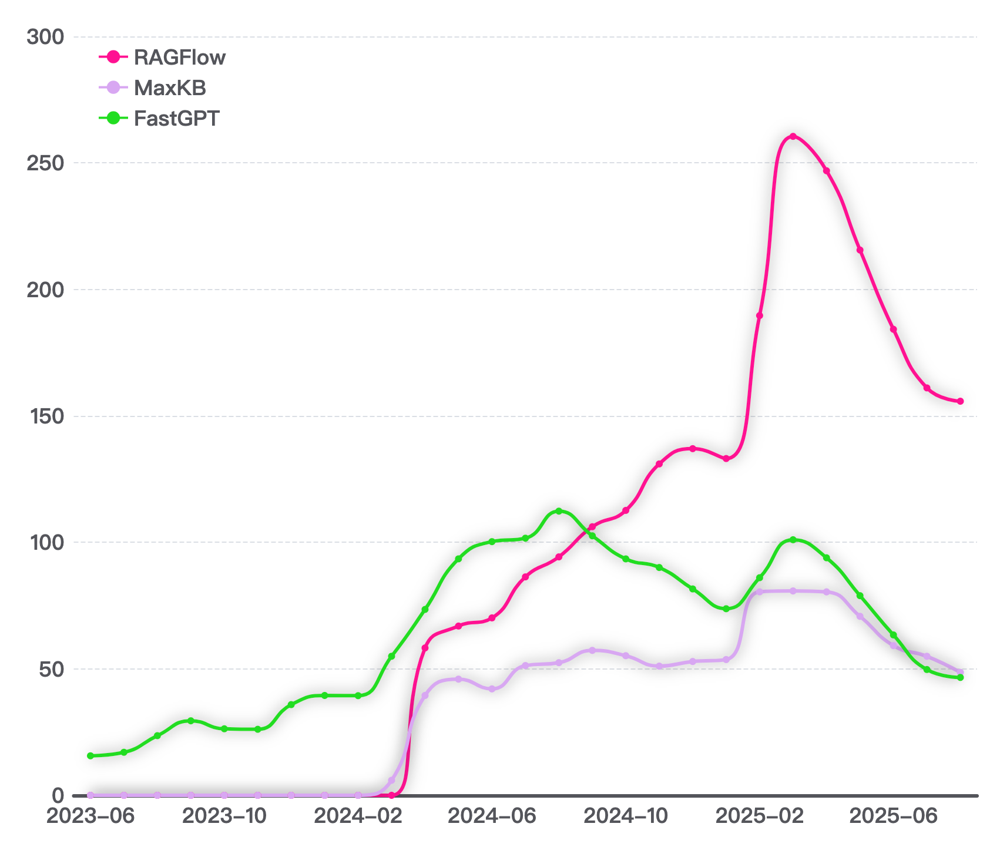
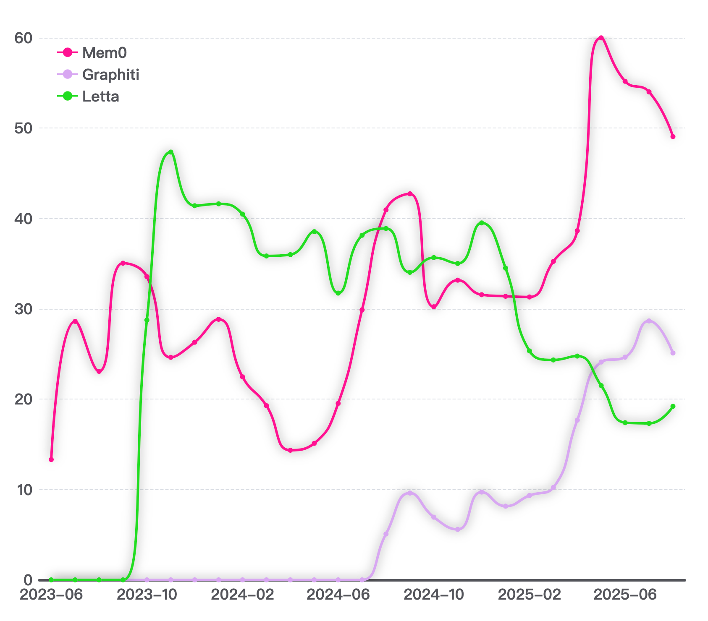

# AI 记忆进化论：从被动存储到智能管理

作者：赵生宇，X-lab 实验室

**记忆系统：AI 竞争的下一个战场**

2025年，大模型的能力逐渐趋同，GPT-5、Claude、Gemini 等顶尖模型在基础能力上难分伯仲。这时，记忆系统悄然成为了 AI 应用竞争的关键变量。谁能更好地记住、理解并利用用户的历史交互，谁就能在竞争中脱颖而出。

想象一下，一个 AI 不仅能记住你的偏好，还能积累领域知识、理解业务逻辑，这样的系统显然比每次都要"从零开始"的无状态模型更有价值。记忆不仅仅是数据的堆积，更是关系的沉淀、信任的建立和场景理解的深化。这种通过时间积累形成的个性化理解和专业知识，构成了 AI 应用最深的护城河——它需要长期的用户交互才能形成，竞争对手即使拥有同样的技术也无法快速复制。

从投资者的角度来看，拥有强大记忆能力的AI产品具有更高的用户粘性和转换成本。用户在切换产品时，不仅要适应新的界面，还要放弃已经建立的所有个性化积累。这解释了为什么从 Meta 到 OpenAI，从Google 到各家创业公司，都在将记忆技术作为核心研发方向。

本文将回顾大模型兴起以来，在记忆方向的技术演进路线和一些主要的开源项目。

## 通用 RAG 系统尝试与局限

大模型风行伊始，就是以聊天问答的形式呈现在用户面前，因此基于知识库的聊天问答就成为了大模型早期一个重要的应用方向，催生出了检索增强生成（RAG）这一热门技术领域。

而 FastGPT、RAGFlow、MaxKB 等开源项目也应运而生。2023 年初 ChatGPT 在国内出圈，云服务厂商环界云敏锐的抓住了这个机会，开发了 FastGPT 并于 4 月即开源并成为了该领域国内最重要的开源项目之一，而 MaxKB 与 RAGFlow 两个项目则均开源于 2024 年初。

这几个项目的共同特点是从严肃的知识库问答 RAG 做起，服务于企业级的聊天问答场景，并持续深化企业服务，均支持了 workflow 工作流编排的能力，协助企业进行 Agent 构建与智能化转型。

从 OpenRank 趋势来看，这几个项目都经历了快速发展时期，FastGPT 和 MaxKB 的发展相对稳定平缓，而 RAGFlow 则在开源后一直高歌猛进，发展迅猛。在 2025 年初 DeepSeek 出圈以及 Manus 爆火使得这几个项目都获取了一波极大的流量，OpenRank 有较明显的提升，但在后续逐渐降温回归正常值。

早期在记忆组件尚未独立和成熟之时，不少开发者都尝试过使用传统知识库 RAG 系统来作为聊天记忆的组件。即通过语义划分将不同的聊天片段视为单独的文档，召回时根据当前聊天的上下文将过去相关的聊天全文检索出来并作为上下文输入模型。这种方式简单直接，但聊天记忆与知识库检索的两个根本区别导致了这种方案的上限较低，很快就碰到了瓶颈：第一是知识库是高度凝练的事实数据，具有信息密度高，结构化程度高的特点。而多轮聊天的内容则形式上较为随意，信息密度较低，内容噪点多，将聊天历史信息全文索引并带入上下文反而会导致生成效果下降；第二是知识库一般是静态文档输入，更新频率较低，一般也不会出现事实错误。而多轮聊天的内容则是持续更新的过程，不仅需要动态进行知识更新，并且聊天过程中甚至可能出现前后的事实矛盾等复杂情况需要处理。

上述两个根本区别也使得传统 RAG 方案很快就淡出了作为多轮聊天记忆的技术方案，让位给更加专注于做聊天记忆的开源项目。

## 传统记忆系统的实现与局挑战

以Mem0、Zep、Letta 代表的第二代记忆系统在解决 LLM 无状态问题上做出了重要贡献。它们通过向量数据库和知识图谱技术，实现了对话历史的持久化存储和语义检索。

这类项目对于聊天记忆均进行抽取分析和压缩存储，从而大幅提升记忆内容的信息密度，减少闲聊内容对记忆的影响。Mem0 采用的记忆压缩技术，能够将对话历史智能压缩，减少 80% 的 token 消耗，这在成本敏感的应用场景中具有较为明显优势。Zep 则通过其 Graphiti 引擎构建时序感知的知识图谱，在 DMR 基准测试中达到 94.8% 的准确率，展现了结构化记忆的潜力。Letta 构建于其研发的 MemGPT 之上，将记忆进行分块分层存储，在上下文组装时更加灵活的进行不同类型的记忆信息的拼接。

而且深度利用知识图谱的 GraphRAG 技术在记忆中有较强的优势，知识图谱不仅可以对聊天内容进行记忆，同时可以构建知识之间的关联性，在检索时将一些具有隐性关系的内容也可以一并召回。其中 Graphiti 是直接基于知识图谱构建的，而 Mem0 也内置了 mem0^g 图检索引擎，可以替代传统向量数据库进行记忆存储。

从 OpenRank 中可以看到，Mem0 和 Graphiti 一直有比较好的发展趋势，而 Letta 则是高开低走。Graphiti 和 Mem0 分别在 2025 年 4 月和 5 月推出了自己的 MCP 服务，这不仅使得大模型的用户可以更方便的在模型使用中加入外部记忆的能力，而且也使得记忆服务完全独立于大模型，可以进行无缝的跨模型迁移。从数据上也可以看到开发者对于 MCP 服务的推出给出了正面的反馈，两个项目的 OpenRank 值在年初均有大幅的增长。

然而，这些系统在面对新一代 AI 应用需求时也暴露出一些结构性的挑战：首先是被动性问题：记忆的生成、更新和检索都依赖于外部触发，系统本身缺乏主动学习和优化的能力；其次是碎片化挑战：尽管有向量相似度匹配，但记忆片段之间的深层关联往往被忽略，导致检索结果缺乏连贯性；第三是扩展性瓶颈：随着记忆量增长，检索效率和准确性都会下降，需要不断的人工优化。

面对上述问题，我们也亟需更自主、更智能的记忆管理方式，上述几个传统项目也在这些新的问题方向上进行持续探索，但也有一些新的开源项目则一开始就使用智能体化的思路进行开发。

## 技术方案百花齐放的新项目

2025 年下半年以来，记忆领域爆发式的出现了一批新的开源项目，他们的技术方案百花齐放，各有特色。

2025 年 8 月开源的 MemU 的思路是"记忆即文件系统"的设计理念：记忆被组织成智能文件夹结构，每个文件夹对应一个知识领域或记忆类型，由专门的 Memory Agent 负责管理。这些 Memory Agent 能够自主判断信息的重要性、决定存储位置、建立知识关联、执行定期整理。更重要的是，这些系统具备"离线学习"能力——即使在用户不活跃时，Memory Agent 也在后台持续工作，整理信息、发现关联、优化结构。这种持续的自我改进机制，使得AI系统真正具备了成长性，其独特的自进化记忆文件夹能够不断优化记忆拓扑，显著提升长期记忆的一致性，能够随着时间推移变得越来越了解用户和业务场景。

而同样在 2025 年 8 月开源的 MIRIX 则更进一步，直接向多模态迈进，在记忆层面不仅支持聊天文本的记忆，同时也支持了图片、音频，甚至可以自主抓取用户的屏幕内容进行分析和记忆。同时 MIRIX 还实现了核心记忆、情景记忆、语义记忆、程序记忆、资源记忆、知识库管理等 6 个相对独立而又相互协同的 Agent 进行记忆的智能管理。而且有趣的是 MIRIX 使用的是 Letta 的开源框架作为底层技术框架进行扩展开发而来，开源技术的传承延续也得以体现。

除了工程层面的持续创新，也有一些团队尝试在模型层面进行突破。例如，同样在 2025 年 8 月开源的 MemOS 项目，不仅实现了记忆的模块化存储，还引入了 LoRA（Low-Rank Adaptation）低秩参数矩阵，使得开放权重的基础模型能够通过微调适应特定记忆的生成需求。与传统的外挂式记忆系统不同，MemOS 不仅通过上下文注入记忆，还通过调整模型的参数矩阵，直接影响了生成过程。如果说传统记忆系统像是一本"日记本"，仅能在生成时提供参考信息，那么 MemOS 则更像是一场"脑科手术"，从根本上优化了大模型的生成机制，使其能够更精准地融合记忆与生成能力。

上述几个项目都集中在 8 月前后开源，MemOS、MemU 和 MIRIX 在开源后一个月左右时间在 GitHub 上分别获得了 2.5k、2.2k 和 1.4k Star，可见该领域对于开发者的吸引力。

## 展望

目前，记忆领域还处于群雄逐鹿的阶段，远未有某个项目达成垄断地位。技术上的探索和创新还在持续发酵。未来，记忆组件很可能会进一步细化应用场景。例如面向工作助理的记忆组件，将以记忆的准确、高效甚至多平台的操作能力作为卖点；而拟人陪伴类的记忆组件，则可能引入更加符合人类记忆模式的机制，如对记忆进行重要性的排序甚至引入遗忘机制等。

记忆系统是大模型应用领域中非常重要的一个技术板块，对于大模型在个体服务层面的定制化具有重要意义。未来，记忆领域相信也会形成统一的技术标准，实现用户记忆数据在不同的大模型和记忆框架之间的无缝迁移，而"基模 + 记忆"的框架也将成为个人定制大模型的标准形态。

记忆系统的开源故事也才刚刚开始，后续的故事我们拭目以待。
