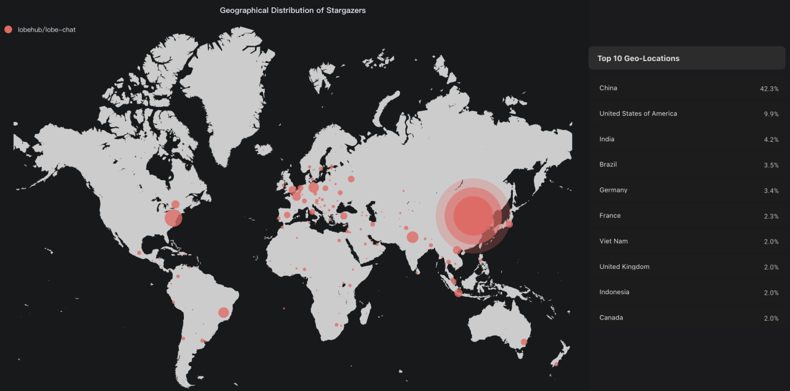
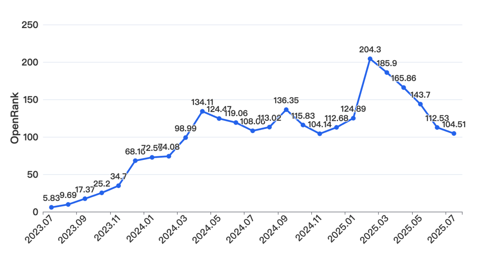
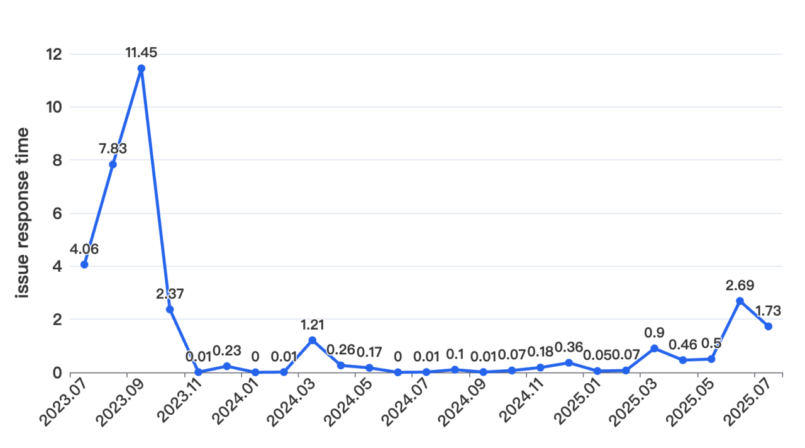
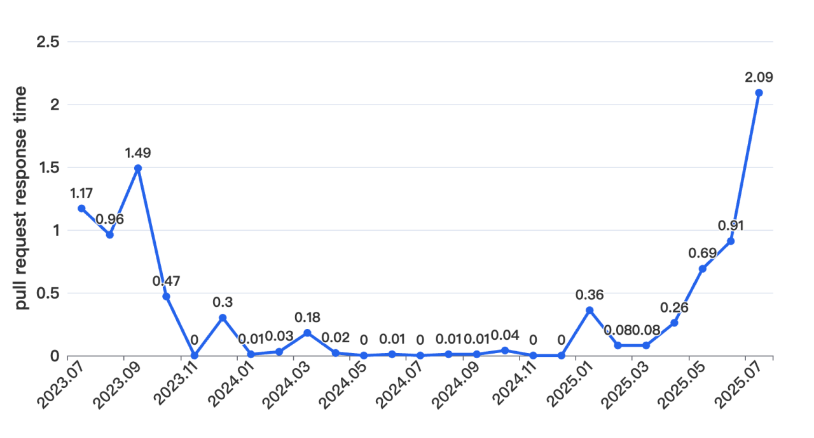

# Lobe‑Chat: 开源多模态 AI 聊天框架的快速崛起与生态影响

作者：韩凡宇，X-lab 实验室

## **从设计工程师到开源框架的演进**

Lobe-Chat 项目由 LobeHub 组织内的一群称为 design-engineer的开发者发起，他们认为市面上的 AI 会话产品体验不足，于是产生了打造一个更舒适、更美观、更易部署的开放式聊天框架的愿望。他们以现代化 UI 设计和 Bootstrapping 方法为基础，推出了支持多模型服务（如 OpenAI、Claude、Gemini、Ollama 等）的产品雏形，同时强调"一键免费部署私人 AI Agent 应用"的理念 。早期 Lobe-Chat 采用 serverless、Local-First 架构，旨在快速响应、高度隐私保护和极简部署体验。随着用户需求增长，如跨设备同步、知识库和持久存储等功能成为刚需，团队逐步演进，规划并推出了 1.0 版本，引入服务器端数据库支持，同时将开源许可从 MIT 升级为 Apache 2.0，以增强专利保护、明确贡献者责任，并为商业使用提供更友好的授权政策 。

该项目在GitHub 截至 2025 年 8 月 22 日拥有 **64.7k 星标**、**13.4k 分支**、**5,991 次提交**、**894 个 Issues**、**86 个 Pull Requests**、**268 位贡献者**。截至当日已发布**1,963 个版本**，最新为**v1.114.5**。

---

## **核心团队与技术布局**

Lobe-Chat 的主要维护者是 GitHub 组织 **LobeHub** 中的两位核心成员：**@arvinxx** 和**@canisminor1990**，致力于将现代化 UI 设计理念与工程实现结合，打造美观、高效、易上手的 AI 聊天框架。其中，**Arvin Xu（@arvinxx）** 是最为活跃的负责人之一，在 GitHub 主页上突显其对 UI 体验和工程质量的关注。他们带领团队采用 TypeScript 及前沿 Web 技术，推出具备插件系统、多模态支持、知识库集成、一键私有部署等功能的 Lobe-Chat，体现出他们在 AIGC 工具生态中推动开源易用性的初心和持续力。

（来源：[ossinsight](https://ossinsight.io/)）

上图中展示了Lobe-Chat项目被关注者的开发者地区分布，可以看到，中国的关注者占比最高（42.3%）；美国则以 9.9% 居于第二，体现了其在北美开源社群中的渗透力。除此之外，印度（4.2%）、巴西（3.5%）、德国（3.4%）等新兴市场与欧洲核心国家也表现出一定规模的关注度，说明 LobeChat 已经超越单一区域，形成了跨大陆的开源社群格局。越南、印尼等东南亚国家与加拿大、英国等发达国家的占比均在 2% 左右，进一步表明该项目正逐步进入全球范围的多元化传播与落地阶段。

## **社区影响力的演进趋势**

从时间序列数据来看，LobeChat 项目的 OpenRank 指标在 2023 年 7 月至 2025 年 1 月期间呈现出总体稳步上升的态势。早期（2023 年 7 月—2023 年 12 月）增长幅度较为显著，反映了项目在初始阶段因功能完善与用户群体扩张而获得的持续关注。进入 2024 年后，OpenRank 基本维持在 100—140 区间波动，表明其社区活跃度与开发参与度已进入相对成熟和稳定的阶段。

然而，2025 年 2 月的 OpenRank 指标出现了跃升式增长（从 124.89 上升至 204.3），结合项目版本发布记录与社区动态，可以推测该峰值增长与以下两个因素密切相关：（1）项目在此阶段完成了对 DeepSeek R1 模型的集成，并引入"链式思维（Chain of Thought）"机制，这一技术更新不仅提升了对话推理能力的透明性与逻辑一致性，也回应了学界与产业界对于可解释人工智能的共同诉求；（2）DeepSeek 作为开源社区中具有广泛讨论度与技术前沿性的模型，本身即带来高度的外部关注，LobeChat 在短时间内完成适配并对外发布，形成了"热点模型—开源框架"之间的协同效应，从而显著提升了该项目在开源生态中的能见度与参与度。

## **社区响应速度（Issue / PR 响应情况）**

从2023年7月至2025年7月的响应时间数据来看，LobeChat项目的Issue与Pull Request（PR）响应效率整体呈现"前期波动、中期稳定优化、后期小幅回升"的特征。

从Issue响应时间维度观察，项目响应效率呈现明显的阶段性变化：2023年7月-9月处于较高水平（4.06-11.45，单位假设为"天"，下同），其中9月达到周期内峰值11.45，可能与当时项目需求激增、维护者精力分散有关；2023年10月起响应效率大幅改善，尤其是11月-2024年12月期间，响应时间长期维持在0-1.21的低位区间，甚至多次出现0（即时响应）和0.01的超短响应，说明此阶段项目建立了更高效的Issue处理机制，社区对用户反馈的重视度与处理能力显著提升；2025年1月-7月，Issue响应时间出现小幅波动回升，2月达到2.69，虽高于中期平均水平，但相较于2023年前期仍处于可控范围。

从PR响应时间维度分析，整体表现比Issue响应更稳定且高效：2023年7月-9月响应时间在0.96-1.49之间，本身低于同期Issue响应水平，体现出项目对代码贡献的优先处理倾向；2023年10月-2024年12月，PR响应时间进一步压缩至0-0.36，超80%的月份响应时间低于0.2，且多次出现0响应（如2023年11月、2024年5月、2024年11-12月），说明项目对代码合并流程的优化更彻底，保障了代码贡献者的协作体验；2025年1月-7月，PR响应时间虽有小幅上升（如6月0.91、7月2.09），但整体仍低于Issue同期响应水平，反映出项目在资源分配上对"代码合并"这一核心协作环节的持续倾斜。

## **集成速度：主流模型与特性**

Lobe-Chat 接入了 **OpenAI（如 GPT-4 Vision）**、**Anthropic（Claude 2/3）**、**Google Gemini（包括 Gemini Pro 与 Vision）**、**AWS Bedrock（Claude、LLaMA 2）**、**ChatGLM（GLM-4 Vision / GLM-3 Turbo）**、**DeepSeek**、**Moonshot AI**、**Groq**、**Qwen**、**OpenRouter**、**01.AI**、**Minimax** 等众多主流模型提供商，还支持通过**Ollama** 接入本地模型，真正实现了纵横云端与本地的灵活切换与部署（支持模型列表取自多个文档与 README）。项目及时响应行业新趋势，例如在 2023 年 11 月上线了视觉识别功能，支持用户上传图片让 GPT-4 Vision、Gemini Vision 或 GLM-4 Vision 等模型理解图像内容，并开启多模态对话体验。除此之外，Lobe-Chat 的插件生态和 Agent 市场也在快速扩展，使用户能够快速接入第三方服务（如图像生成、实时信息检索）并打造具备功能调用能力的智能助理，进一步加速了对上游模型与下游应用场景的融合。

---

**快速迭代与生态扩展**

LobeChat 项目自早期 0.x 阶段以来一直保持着极高的发版频率，2024 年 6 月推出了标志性版本 **1.0**，首次引入服务端数据库与用户身份认证系统，为项目后续加入知识库、跨设备同步等功能奠定基础。此后，2025 年 2 月初的版本 **v1.49.12** 集成了**DeepSeek R1 模型**，并引入"链式思维"（Chain of Thought）机制，让 AI 对话过程更加透明且具有逻辑性。2025 年 7 月中旬至下旬，项目的 Docker 版本更新密集，包括加入 Google AI Imagen 图像生成功能、支持 Zhipu CogView-4、重构桌面版 OAuth 支持远程会话、增强 Amazon Cognito 认证以及网络代理功能等一系列实用功能。进入2025 年 8 月，LobeChat 更是以日更节奏连续发布多个版本（如 v1.114.1、v1.114.2、v1.114.3 和 v1.114.4），重点进行了数据库架构重构与代码分包优化，确保平台稳定性与模块化效率。

---

## **社区支持与商业赞助的双轮驱动**

LobeHub / Lobe-Chat 项目核心资金主要来自社区的自发赞助和协作；他们通过 [GitHub Sponsors](https://github.com/sponsors/lobehub) 和 [Open Collective](https://opencollective.com/lobehub) 接受个人用户与组织的小额资助，透明记录赞助人名单与资金流动（如今年总筹资约 1,580 美元）。2024 年 7 月，[LobeHub 与拥有广泛 Google 企业服务背景的 Master Concept 建立了 **战略合作伙伴关系**](https://lobehub.com/ja/blog/lobehub-and-master-concept-announce-partnership)，Master Concept 成为 LobeChat 的黄金赞助商（Gold Sponsor），为企业用户提供定制开发、半托管服务和 Google Gemini API 集成支持，这标志着项目迈入更专业的商业应用领域。
