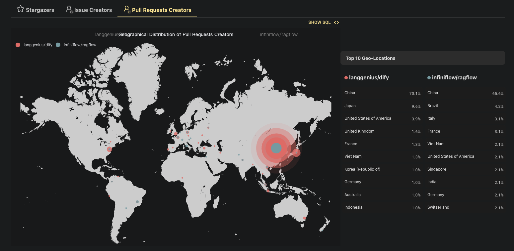
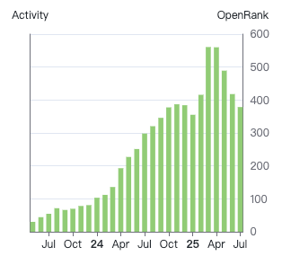
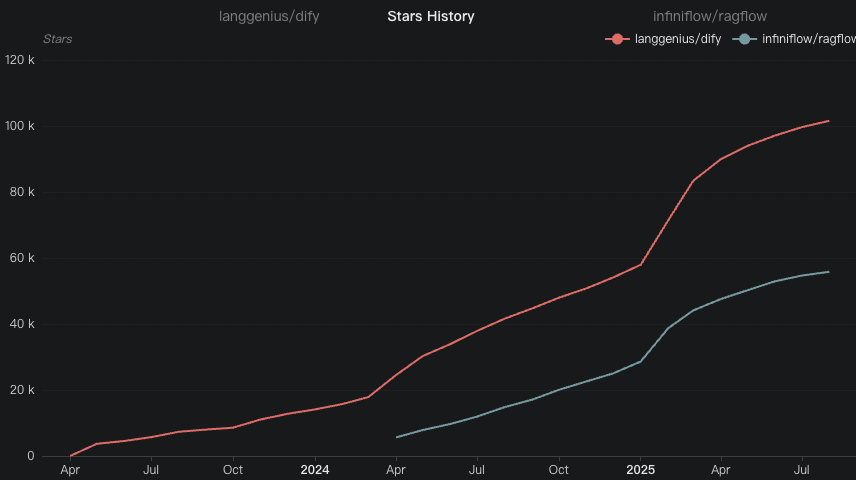
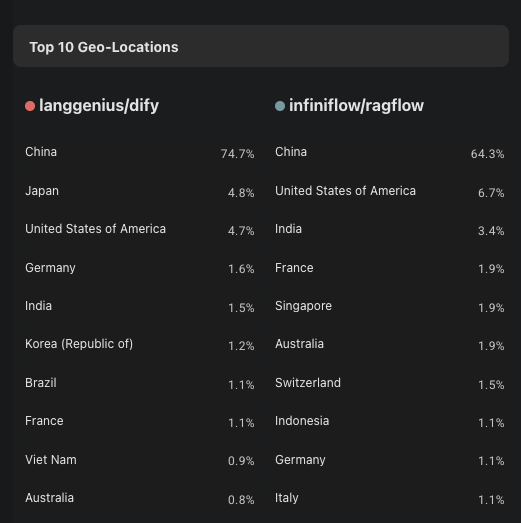
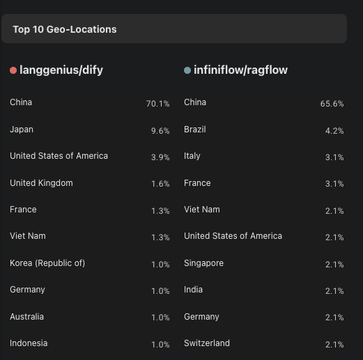
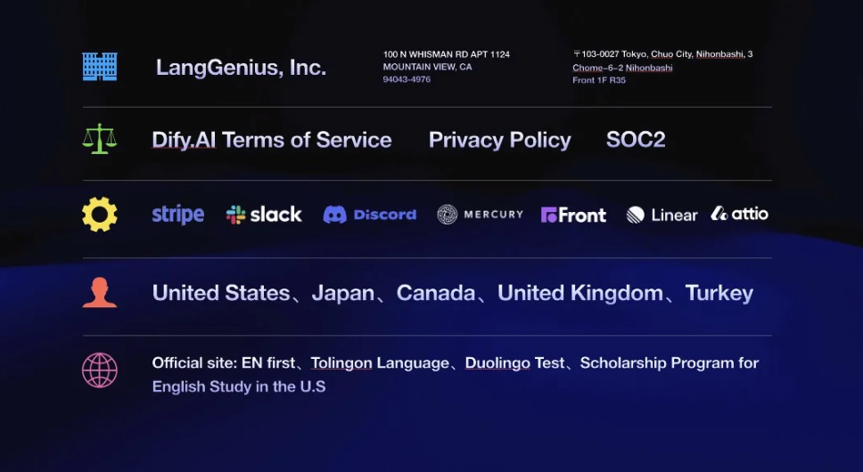
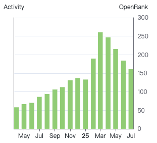

# Dify 与 RAGFlow 的全球化与商业化之路

作者：彭佳桓，X-lab 实验室

在人工智能技术浪潮的推动下，大型语言模型（LLM）应用开发正迅速从高门槛的专业任务转向普及化的生产力实践。Dify 与 RAGFlow 作为两个备受瞩目的开源项目，分别从"低代码应用开发"与"深度检索增强生成（RAG）"两大关键维度推动这一进程。它们在技术架构、生态策略与商业化路径上展现出截然不同的风格，却共同成为开发者构建智能应用的重要基础设施。本文将从产品定位、技术特性、开源生态、全球化布局与商业模式等角度，对这两个项目进行全面深入的对比分析，为开发者及企业中的技术决策者提供选型参考。

# Dify与RAGFlow概述

Dify是一个开源的**LLM应用开发平台**，它提供了**一站式的解决方案**，使得开发者能够快速地从原型设计到产品部署。Dify的核心是其对LLM（大型语言模型）的集成，它支持多种预训练模型，并且允许用户自定义模型的训练和微调。Dify的用户界面直观，功能全面，使得开发者无需具备深厚的技术背景，也能轻松地开发基于LLM的应用。

Ragflow是一个专为**深度文档理解和检索增强生成**而设计的引擎，它结合了预训练的大型语言模型（LLMs）和高效的检索技术，为用户提供了一个强大的工具来处理复杂的问题和场景。RAGFlow的核心优势在于其混合检索能力，它能够从大规模知识库中检索相关文档，然后将这些信息与模型的生成能力相结合，生成更准确、更全面的答案。这种混合方法特别适用于处理需要深度理解和综合多个信息源的问题，如智能客服、搜索引擎和知识库应用。

下面是Dify与Ragflow在用户使用上的对比：

| **特性对比** | **Dify** | **RAGFlow** |
| :---: | :---: | :---: |
| **核心定位** | **LLM应用开发平台** | **深度文档RAG引擎** |
| **用户界面** | 可视化工作流/知识库管理界面 | 可视化文档/RAG配置界面 |
| **主要用途** | **快速构建**各类LLM应用（聊天、生成、Agent等） | 处理复杂文档，构建**高性能**RAG系统 |

# 技术优势与平台侧重点

### Dify的最大优势在于其用户友好的开发体验和全面的功能集成

作为一个开源的LLM应用开发平台，Dify提供了低代码甚至无代码的开发体验，使得非技术用户也能快速上手。Dify有两大特性：

**模型中立性：Dify强调模型中立性**，允许用户在没有限制的情况下使用各种模型，这种方法使开发者能够在AI应用开发中探索不同的途径，而不被特定模型或框架所束缚。

**工具扩展能力**：Dify提供了丰富的工具扩展，非常方便开发者集成各种功能。

### Ragflow的最大优势在于其卓越的文档理解和处理能力

在文档解析能力方面，多项调研结果一致表明，Ragflow在工业界开源RAG项目中的文档解析能力最为出色。它能够自动识别文档的布局，包括标题、段落、换行，甚至图片和表格等复杂元素。

**检索质量优化**：Ragflow采用基于模板的文本切片与可视化调整技术，以及多路召回与重排序优化策略，能够显著提升检索结果的准确性。

**文档解析结果反显和编辑功能**：Ragflow支持文档解析结果反显和编辑功能，使用户能够更直观地了解文档处理的过程，并对结果进行必要的调整，增强了系统的可控性。

下面是Dify与Ragflow在技术层面的对比：

| **技术优势对比** | **Dify** | **RAGFlow** |
| :---: | :---: | :---: |
| **RAG能力** | 内置完整管道，可视化管理 | 无内置 RAG，需通过组合节点（数据库/API）实现 |
| **Agent能力** | 内置支持（ReAct, Function Call） | 支持 Agentic RAG |
| **技术栈侧重** | **LLM 应用开发框架**，RAG, Agent | 文档解析，**RAG算法优化**，Agentic RAG |
| **部署方式** | 云服务（Sass）、自托管、**企业版** | 云服务（Demo）、自托管 |

根据上述表格，可以分析得出这两个开源项目的截然不同的**应用场景**：

**如果想快速构建一个端到端、带有用户界面的LLM应用**，并希望有可视化的工作流和知识库管理功能，同时不太介意界面的品牌标识或不涉及多租户SaaS服务，**Dify** 是一个强大的选择。

**但是如果需要处理大量格式复杂、结构多样的文档，并希望构建一个高度优化、具备深度文档理解能力的RAG系统**，而不必过于关注整个应用的前端构建，**Ragflow** 是一个强大的专业引擎。

# 开源社区与生态

### GitHub star热度

图 3 Dify（左）与 Ragflow（右）的近期star数对比

截至 2025年4月，Dify 在 GitHub 上已获得 112k+ Star，Fork 数超过17.1k；RAGFlow 相对略少但仍有 62.9k Star、6.5k Fork 。**Star数量表明Dify是当前炙手可热的项目（Dify凭借强大功能在短时间内激增星标），RAGFlow尽管出现较晚但也迅速吸引了众多关注。通过持续上升的star数，预测未来这两个项目会持续蓬勃发展。**

**与此同时，两者的的更新频率都很高**：例如 Dify 在不到一年时间里发布了 100+ 次版本更新（最新稳定版 v1.7.2 于2025年8月初发布 ），RAGFlow 自2024年开源以来迭代到 v0.20.3（2025-08-20发布）。从频繁的版本迭代和最近更新时间中可以推测出，**这两个项目是其公司的重点关注项目，开发团队在持续积极地维护和扩展功能。**

### 社区协作贡献趋势

图 4 Dify （左）与 Ragflow（右）的近期OpenRank对比

从社区的协作影响力（OpenRank）来看，如图4所示，Dify（左）与RAGFlow（右）都在2024年7月至12月期间OpenRank值急剧上升，在2024年3月后有所回落，但仍维持在较高水平。

值得关注的是2025年的3月和4月，Dify和Ragflow月度OpenRank增长值到达了最高，我们推测可能是因为2025年3月11日，**OpenAI推出Agents SDK**，帮助开发者更轻松地构建AI智能体。同样在3月的27日，**OpenAI 还宣布其Agent SDK开始支持MCP**。进一步方便了社区开发者积极利用 Dify 和 RAGFlow 对新模型 API 的快速集成能力，**这一技术红利直接体现在了社区协作指标的大幅攀升上**。

同时，从Issue和PR的数量看，**Dify**当前有约600多个开放Issue，**社区参与讨论较为活跃**；Ragflow的Issue数达到2.7k ——这可能包含**用户求助和功能建议，显示出社区对该项目的浓厚兴趣**，不过Pull Request相对较少，我们推测PR可能是**主要由核心团队主导开发**。

### License 和**商用应用可行性**

下表列举了Dify与RAGFlow的开源许可协议与商用可行性的相关数据，Dify和RAGFlow的开源许可协议都是基于Apache2.0，但Dify在Apache2.0的基础上增加了几个附加条件。下面会详细介绍Dify和RAGFlow的许可协议，以及分析他们的商用可行性。

| | **Dify** | **RAGFlow** |
| :---: | :---: | :---: |
| 开源许可证 | Apache 2.0 (附加条件) | Apache 2.0 |
| 商用可行性 | 高 (注意多租户 SaaS 及 LOGO 限制) | 高 (Apache 2.0 允许) |
| 定价策略 | 免费（开源）起步，付费订阅 | 免费（开源） |

Dify采用修改后的Apache License 2.0，增加了两个附加条件：

1. 禁止未经明确书面授权运营多租户环境（一个工作空间对应一个租户）。
2. 使用Dify前端时，不得移除或修改LOGO和版权信息。贡献者同意代码可能被用于商业目的，包括其云服务。

### 国际化的开发者生态

图5 Dify与 RAGFlow 各国开发者的分布

通过对 Dify 与 RAGFlow 两国项目在全球主要地区的开发者分布及协作行为进行分析，可以清晰看出两者在开源国际化生态构建上的异同与进展，并反映出技术浪潮对开发者参与度的显著影响。

从开发者地域分布来看，Dify 和 RAGFlow 均显示出较强的全球化特征，但重心有所不同。虽然Dify 和 RAGFlow 的开发者中，中国开发者均占比最高。**但Dify的issue和PR协作开发者占比（参考图6），排名第二和第三的均为日本和美国**，RAGFlow 则不同，分别是巴西（4.7%）、意大利（3.1%）和美国（6.7%）、印度（3.4%），呈现出**更均匀的跨大陆分布趋势**。

结合 OpenRank 数据来看，Dify 的社区协作影响力始终保持在 RAGFlow 的两倍以上。我们推测，这一现象可能与 **Dify 公司层面在日本和美国等重点市场设立海外分公司、开展有组织的协同运营有关**；相反，**RAGFlow 则更依赖于自然形成的开源社区来吸引全球开发者**，这种不同的运营机制可能导致两国项目在 Issue 和 PR 来源国的分布上呈现出显著差异。

**图6 Dify与RAGFlow的各国开发者的issue（左）和PR（右）的对比**

总体而言，可以从图上看出Dify与RAGFlow在社区健康度与可持续性对比，我们可以推测得出一些结论：

**Dify是有组织运营驱动的高效协作**：Dify的OpenRank值是RAGFlow的两倍以上，同时star数等等也是一直高于RAGFlow，**我们推测这与其在美、日等高价值市场的高占比相辅相成**。这表明其有组织的运营不仅带来了用户量，**更高效地转化出了协作价值，社区活跃度和影响力高度集中**，商业转化路径清晰。

RAGFlow**则是草根社区驱动的广泛影响力**：RAGFlow在更多国家和地区拥有贡献者，虽然单个国家的OpenRank贡献可能不高，但这种**"去中心化"**的结构使其社区基础可能更为广泛和稳固。这种由下而上、基于共同技术需求的社区模式，虽然初期影响力指标（OpenRank）可能不及有组织运营的项目，**但其生态可能更具弹性和可持续性**，更符合典型的开源项目演进路径。

# **Dify的全球化布局与商业化实践**

### 全球化进程所做的工作

Dify 的**商业化成功与全球化战略**根植于其创始团队的前瞻性布局与深度市场洞察。创始人张路宇早在2023年3月项目启动之初，就明确将"全球化"、"开源"和"企业级"确立为三大核心战略支柱，这一理念贯穿产品迭代与市场拓展全过程。Dify 之所以在商业化道路上取得显著成效，关键在于其精准把握了大模型中间件市场的空白，并以开源模式快速构建全球生态壁垒。其商业化路径并非依靠传统SaaS的高额营销推动，而是通过开源社区的自然增长和产品价值的内外传播，实现低成本全球获客，尤其在日本、北美和欧洲市场增长迅猛。

图7 Dify为了做全球化所做的准备

如上图所示，为了推动全球化进程，Dify进行了多方面的架构设计与系统性准备：

比如，在公司层面，Dify以美国特拉华州注册为主体开展全球服务，从法律和运营结构上为国际化奠定基础。在产品层面，**团队注重语言与文化适配**，除英语、日语等常见语种外，**甚至在GitHub页面的md文档里提供了《星际迷航》中的克林贡语选项，以增强西方用户的文化认同感和社区黏性**。

全球化产品的实现不仅限于语言层面，Dify还高度重视合规建设。他们聘请了顶尖的国际律所，积极推进SOC2等权威认证，以满足不同地区用户对数据安全和合规性的期待，并确保所有数据均存储在符合当地法规要求的区域。

团队构建方面，Dify致力于打造真正具备全球协作能力的组织。他们搭建了一套高效的国际化工具体系，例如**使用Front处理客户邮件**，**利用Linear进行需求流转**，以支持分布式的开发和管理流程。面对中间件产品特有的挑战——左侧需对接快速迭代的模型生态，右侧需响应不断变化的应用需求——Dify特别注重提升信息吞吐和产品迭代速度，以保持技术前沿竞争力。

### Dify 盈利的关键——PLG ToB

**Dify 采用的「PLG ToB」（Product-Led Growth to Business）模式**，是其实现盈利的核心策略。该模式强调以**产品本身为推动力**，通过**自助式体验和开源生态实现低成本用户获取和自然增长，最终转化企业级客户为付费用户**。与传统的强销售驱动的 ToB 模式不同，PLG ToB 不依赖庞大的销售团队或高额的市场预算，而是通过产品的易用性、透明性和持续价值吸引用户主动采用和推广。

在生成式AI竞争异常激烈的市场环境中，Dify 意识到传统SaaS模式在获客成本和市场扩展效率上的局限性。因此，团队选择以开源为基础、以产品为导向，实现极低摩擦的全球市场覆盖。这种策略的效果显著：Dify 在成立不到一年半的时间内，已成功为全球500强企业中的40家提供服务，而总市场费用不足40万元人民币，获客成本几乎为零。

这一模式不仅极大缩短了盈利周期——传统企业通常需两年以上达到盈亏平衡，而PLG ToB型公司可压缩至7-8个月——还为中国开发者和企业提供了一个可复制的全球化路径。Dify 的成功证明，通过产品驱动和社区共建，初创公司完全可以在不依赖巨额资金投入的情况下，高效触达并转化高质量的企业用户。

### 开源对做 ToB 市场的好处：建立信任

**开源在 Dify 的 ToB 战略中扮演了建立全球信任的关键角色**。Dify 基于 Apache 2.0 协议（附加合理商业限制）开放全部源代码，使任何用户都可以审查代码、跟踪开发进度甚至参与项目贡献。这种开放性极大降低了企业客户的风险顾虑，帮助他们从技术层面验证产品的可靠性、安全性和工程成熟度。

对于很多国际企业而言，选择技术供应商时尤其关注其透明性与可信度。开源作为一种"自证清白"的方式，使 Dify 能够快速打破地域和文化隔阂，尤其**缓解了海外用户对中国背景团队的初始质疑**。通过公开提交记录、议题讨论和构建过程，Dify 展现出专业、认真和持续迭代的团队形象，逐步建立起全球用户的信任。

此外，开源也成为** Dify 实现高效 GTM（Go-to-Market）的重要推手**。它使 Dify 以近乎零成本的方式触达全球开发者社区，加速产品反馈循环和功能迭代，并在扩大影响力的过程中，为付费功能和企业级授权服务奠定信任基础。正是在这样开放、协作的基础上，Dify 实现了从社区到商业的成功跨越，打造出一个真正具备全球竞争力的产品品牌。

# **结论：**

综合来看，Dify 在社区影响力、商业化成熟度及全球化运营方面显著领先于 RAGFlow。其 OpenRank 值持续为 RAGFlow 的两倍以上，反映出更强的社区协作活力和技术影响力；Star 数更高且增长更快，代表更广泛的开发者认可。商业化上，Dify 凭借清晰的 PLG ToB 模式和 Apache 2.0 带合理限制的许可协议，在几乎零市场投入的情况下，已成功服务数十家全球500强企业，展现出**高效的付费转化能力**。其**有组织的全球化运营**——包括在美、日等高价值市场设立实体、**推进合规认证**、**实施文化适配策略**——进一步巩固了其在全球开源生态中的领先地位和品牌竞争力。
