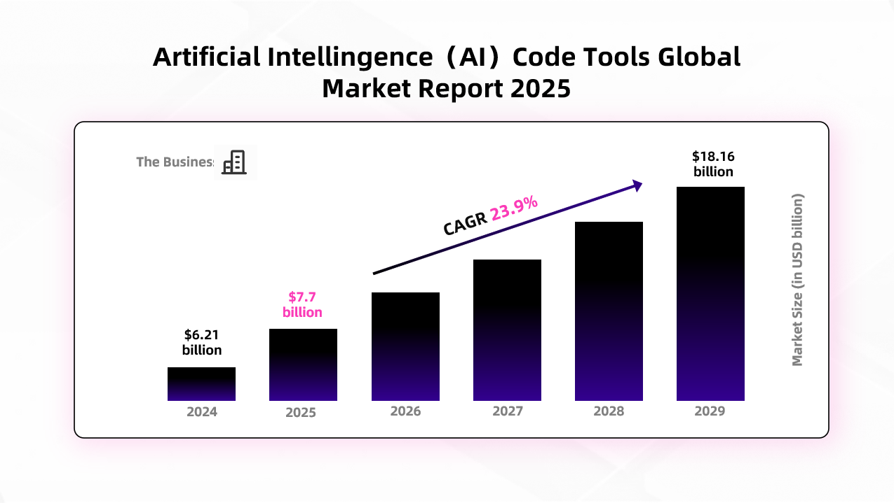
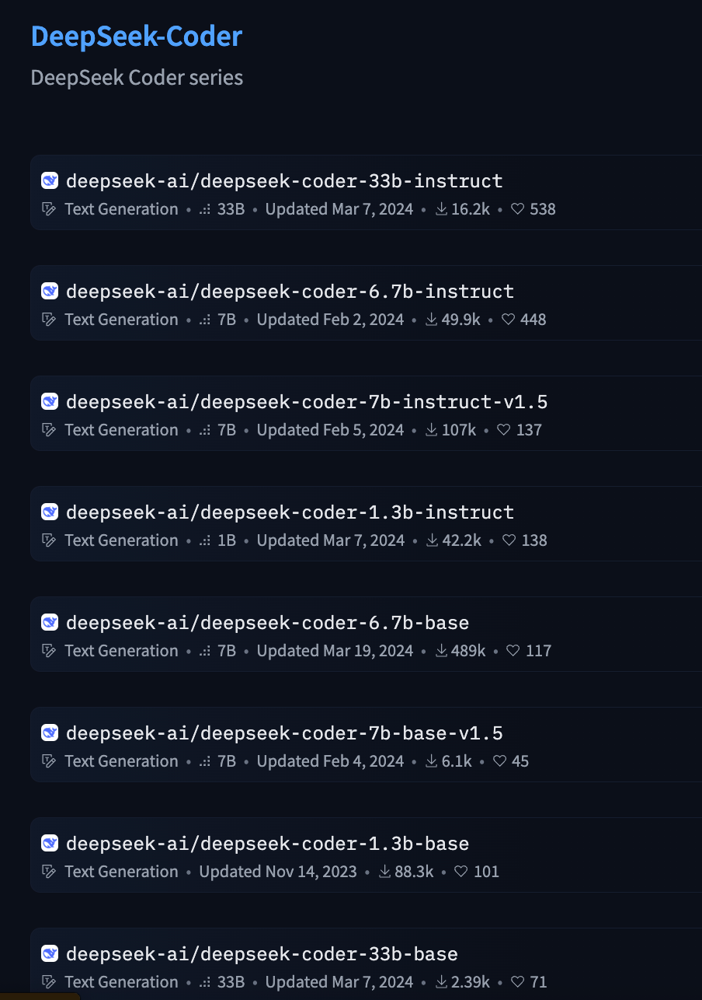

# AI Coding 变形记 V2.0

> 今年 5 月，我们发布了 AI landscape 白皮书，当时有一个篇章是 AI Coding 主题，当时匆忙之中完成了[AI IDE 的探索之路](https://yuque.antfin.com/congrong.dc/tuk9v1/xt0olpbu5vxb6q92)，Coding 可能是第一个找到所谓 PMF 的方向…如今百天过去，AI Coding 已经进入下半场，Coding 到底是 AGI 的子集还是新路径，我们一起略窥一二。

作者：董超，蚂蚁开源

## 摘要

过去三年里，AI 编码从"补一句代码"跃迁为"承包一次变更"。**2023** 年巨头坐实范式、开源露出"可执行"的苗头；**2024** 年开源 _Executable Code Agent_ 与 _Permissioned Automation_ 合流，真正把"提示"落成"动作"；**2025** 年进入形态之争的加速段，**CLI** 之所以出圈，不是因为"命令行更酷"，而是它把**可组合、可治理、可迁移**三件事一次性打通。胜负的关键，正在从"谁补得更顺"转向"谁更懂你的代码资产、能稳定完成执行闭环、还能以开放方式嵌入团队工作流"。

## 一、三年演进：范式落地 → 开源上位 → 执行力为王

### 2023：范式落地，"可执行代理"苗头已现

如果要给 2023 下一个极简注解，那就是：**范式被大型平台坐实**，**开源在边缘地带萌芽**。前者不难理解——Copilot 与 ChatGPT 把"人写—AI 辅"的协作方式带进了日常；后者更值得留心：初创公司和个人开发者开始探索"**不仅会说，还要能做**"。我们能在当年的两个方向上嗅到这种味道——

+ **IDE/多端一体化**：Continue 以开源扩展与 CLI 同步推进，让"对话、补全、结构化编辑、Agent 工作流"在 VS Code / JetBrains / 终端间贯通，初步具备"把建议落成动作"的骨架。
+ **本地可执行**：Open-Interpreter 把"和模型对话→让它在本机跑脚本/代码"的路径公开化，终端里一条命令就能进入循环试错。

它们还不是"产业级代理"，却清晰地为次年的**开源 Code Agent**热身：从"能聊代码"迈向"能动手"。

### 2024：Code Agent 上位，社区百花齐放

来到 2024，Coding Agent 从舞台边侧走到中央，形成两股彼此强化的潮流。

**第一股：可执行的 Coding Agent ，开始对真实仓库交付**。

**OpenHands（原名：OpenDevin ）**，直言"面向软件开发的 AI 代理平台"，强调从**计划→调工具→编辑代码→跑命令/测试→产出 PR**的一条龙闭环，且在项目文档中明确"**formerly OpenDevin**"，标志着 **Coding Agent **从演示走向工程与评测。

**第二股：IDE 内的"许可式执行"成为交互共识**。

**Cline** 把代理装进 VS Code，但每一步都走**用户授权**：读/改仓、开终端、启浏览器皆需你点头。自动化有了抓手，可控性也不丢，这套 _user-in-the-loop_ 范式，恰好契合工程团队的安全与可观测诉求。

与之并行的，是"对话 → 可跑应用"**的云端工作台：**

**StackBlitz · bolt.new 以 WebContainers 为底座，把"Prompt→运行→部署/分享"压成直线。它不是替代 IDE，而是把**从想法到可运行这条链路极限拉短，成为前端/全栈原型场景的高频入口，并迅速形成开源社群与使用高潮。

2024 的关键词是 **可执行代理 + 许可式自动化**。一个把"提示"落成"动作"，一个为"动作"加上刹车与护栏；两股合力让"写—测—改—提 PR"真正跑起来，也自然把目光推向 2025 的"形态之争"。

### 2025：形态之争进入加速段，CLI 成了主战场

到了 2025，AI Coding 的主线从"谁补得更准"转向"谁把一次变更**稳妥地跑完**"。这也是为什么 **CLI 形态**格外出圈：它天生贴着脚手架、测试与 CI/CD，最容易把"读库→计划→修改→验证→提交 PR"的闭环压缩在开发者熟悉的命令与脚本里。**Claude Code** 代表了这种"终端即中枢"的范式：官方把它定义为 _agentic coding_ 的终端工具，并给出完整的 CLI 参考与工作流示例，让代理在命令行里承包从 Issue 到 PR 的整活，这种"拉直执行链路"的体验，是它能够走红的直接原因。

与之并行，**开源 CLI 代理**把"好用"与"可治理"结合得更紧。**Gemini CLI** 以 Apache-2.0 开源发布，本身就是一套可插拔的命令行工作台；更关键的是，它把 **GitHub Actions** 做成"一等公民"：在仓库里 @gemini-cli 便能触发协作任务，或直接将其编排进团队工作流，使"代理执行"天然具备可观测与可回归的工程属性，这解释了它在团队侧迅速扩散的动能。

如果说 Gemini CLI强调的是"协作原生"，那 **SST 的 Opencode** 则把"本地可控与多模型自由度"做到了极致。它坚持 **100% 开源** 与 **供应商无锁定**，在 TUI 里流畅地切换 Anthropic、OpenAI、Google 甚至本地模型；对希望控制成本、规避锁定、又想保持手感的开发者而言，这正是"能长期落地的开源气质"。

另一条支线来自 **OpenAI Codex**：一头连着本地 **Codex CLI**（强调"轻量、脚本化、在你机器上跑"），一头连着 **Codex Web / IDE 集成**（把并行执行与仓库上下文搬到云端）。这种"本地自治 + 云端加速"的双轨设计，等于把可执行代理做成了一个可扩展的**通用底座**，既顺着当下 CLI 的热度，又为之后的系统级协同留出了增长曲线。

综上，今年项目"火爆"的共同逻辑并不神秘：**谁把执行闭环做得最顺、最可插拔，谁就最容易赢得团队侧的采用**。CLI 之所以成为主战场，是因为它把"可组合（脚本/管道）""可治理（权限/审计/观测）""可迁移（接现有工具链）"三点合而为一；而开源项目之所以在这一波里占优势，则在于它们更容易成为"**标准拼装件**"：既能接入 IDE 与 Web 工作台（例如前一年流行起来的 bolt.new 这类"对话→可跑应用"的入口），又能下沉到 CI/CD 的底层执行。接下来，胜负将更多取决于**上下文理解与工具生态**（谁更懂你的代码资产）、**推理与稳定性**（复杂改动能否一把过）、以及**开放与成本**（是否便于团队规模化落地）。

针对近几年如火如荼的 AI Coding 领域，市场侧也给出背书，根据 The Business Research Company 的数据，全球 AI 编程工具市场规模预计将从 2024 年的 62.1 亿美元增长至 2029 年的 182 亿美元，对应 CAGR 为 24.0%。某种意义上，这是"渗透率 + 客单价 + 组织级复用"的合力。

## 二、数据脉动：新上榜与"长红"并存，生态换挡加速

与 5 月份的 Landscape 相比，百日后我们看到"两端拉长"的态势：**Cline、Continue、OpenHands** 等"长红"项目稳居高位，同时 **Gemini CLI、opencode、goose、marimo、openai/codex、avante.nvim** 等"新面孔"快速上行。

| **项目名称** | **是否新增** | **openrank_07** | **stars** | **trend** |
| --- | --- | --- | --- | --- |
| google-gemini/gemini-cli | new | 391 | 66881 | [191, 391] |
| sst/opencode | new | 195 | 17071 | [19, 102, 195] |
| cline/cline | - | 181 | 48658 | [109, 133, 147, 163, 184, 175, 181] |
| block/goose | new | 139 | 18122 | [71, 93, 98, 110, 118, 126, 139] |
| continuedev/continue | - | 134 | 28087 | [143, 166, 175, 179, 180, 146, 134] |
| All-Hands-AI/OpenHands | - | 132 | 61700 | [120, 127, 118, 131, 139, 135, 132] |
| marimo-team/marimo | new | 82 | 15068 | [62, 65, 73, 83, 85, 86, 82] |
| openai/codex | new | 81 | 35282 | [137, 130, 96, 81] |
| yetone/avante.nvim | new | 60 | 15439 | [57, 75, 89, 79, 81, 79, 60] |

这组数据背后，我们可以看出：

1）**协议/接口优先**的项目扩散更快（如 ACP/MCP 生态、Actions 一等公民）；
2）**本地可控 + 多模型自由度**带来开发者粘性（opencode、Avante.nvim + Ollama）；
3）**从原型到交付的链路被压短**（bolt.new、Codex Web），降低了"从想法到产物"的门槛。

纵览近两年的热门项目，其出圈背后有以下因素：

+ **降低"黑箱云端"的心智负担**：优先在本地/可控环境动手，审批与可追踪执行是默认能力；
+ **协议优先、生态可插拔**：MCP/ACP/ACI 等把"工具—代理—宿主"解耦，IDE/终端/CI 的接入成本骤降；
+ **开发体验"一条龙闭环"**：从建议到自动打补丁、测试、PR、回滚/审计，交付路径更短；
+ **"Vibe Coding" 让代码平权**：自然语言操控仓库与脚手架，更多角色能参与原型与运维，但生产级仍强调审阅与回归。

## 三、为什么今年偏爱 CLI ？是个例还是趋势？

以新上榜的 Gemini CLI 为例，它到底是什么？

Gemini CLI 是 Google 开源的命令行智能代理，目标是"从你的提示直达模型"，把代码生成、改动、测试与协作动作嵌回到开发者最熟悉的终端里。项目采用 Apache-2.0 许可证，并提供官方的 GitHub Action（run-gemini-cli），将"代理执行"直接接入仓库级工作流（Issue/PR 触发、@gemini-cli 命令派发等）。这使它既是"个人终端工具"，也是"团队协作节点"。

为什么它"上来就很像团队的工具"？

+ 协作原生：官方 Action 把它做成"仓库的一等公民"，可在 PR/Issue 上自动值守：分拣与优先级、出测试、补修复、响应 `@gemini-cli` 命令等；企业侧可用 Google Cloud 的 WIF（Workload Identity Federation）做安全集成，减少长期密钥暴露。
+ 上下文与容量：官方口径对外强调与 Gemini Code Assist、MCP 等生态协作，并主打"大上下文 + 高频免费限额"作为开发者冷启动的动力。这类"足够用"的默认配额，降低了团队一线尝试的门槛。
+ 从 CLI 到 CI 的"半步距"：开发者本地跑顺手后，几乎零改造就能把同一套命令编排进 GitHub Actions 里做回归与可观测。对于需要"把 Issue 变成可审 PR"的团队而言，这一步是决定能否规模化推广的关键。

因此，它更适用于需要"默认协作"的组织，希望让代理围绕 PR/Issue工作，而不是只在本地 IDE 里"帮我写点代码"。不过，值得注意的是，与 IDE 内部深度上下文的体验相比，CLI/CI 形态对"细粒度编辑体验"的可视反馈较少，必要时可与 Cline/Continue 这类 IDE 代理搭配使用；

Gemini CLI 不是"更酷的命令行"，而是"把代理直接变成团队协作节点"的范式样本——这正是 2025 年 CLI 出圈的缩影：承接现有脚本 → 接入 CI/PR → 形成可观测的执行闭环。

这并不意味着 **IDE/插件** 与 **Web 工作台**式微：前者在"所见即所得"的上下文编辑上仍是个人效率之王（如 Cline、Continue），后者把"从零到可运行/可分享"的链路缩到极短（如 bolt.new）。**CLI** 则是团队把自动化落地的"承力面"。三者是**界面层**的取舍，而非零和博弈。

## 四、从应用到模型："模型吞噬应用"的回响

应用侧的卷法，终究受制于模型侧的跃迁。比如 Qwen3-Coder 模型可以为模型配置读写文件、列举文件等工具，使其可以直接修改代码文件。

_图：Qwen3-Coder collection /DeepSeek-Coder collection_

互联网巨头的大模型在 Coding 榜单名列前茅，最近陆续下场，借助简洁的命令行形态调用模型，进一步增强模型能力。我们从 HumanEval、SWE-Bench verified、LiveCode-Bench 这些专业的代码大模型榜单可以看出，OpenAI 的 O3 、Anthropic 的 claude、Google 的 Gemini 均稳稳占据前三。OpenAI 是在调出了 O3 之后，推了 DeepResearch 和增强版本的 O3Search；打了 perplexity 的主阵地；ClaudeCode 是在 Claude3.7 独占 Coding 领域一段时间后，和 Claude4 一起发的，虽然形态不是 IDE，但也引起了大量程序员的切换。当模型迭代到"**能理解仓库 + 能稳态执行**"，**仅做"调用包装"的工具会更难存活**——这也是为何协议、流程与数据（而非"只换个 API"）正在成为真正的护城河。这种"降维打击"被迫让很多开源项目最终进入"墓园"，昙花一现。

## 五、技术剖面：AI Coding 的"五层堆栈"

AI Coding 迭代极快，如果不把这些项目放进统一的技术坐标，很容易陷入"今天谁加了新按钮"的比较，而忽视了会决定**长期护城河**的层次。同时由于模型侧"降维打击"来得更快（榜单换代、推理升级、本地化增强），只有把能力拆到层上，才能在模型换代时替换最上游的一层，而不是推倒重来。因此，为了防止过度追逐热点项目导致失焦，我们把 AI Coding 拆解为五层堆栈，

1）**接口形态（IDE/CLI/Web）**：决定人机边界与团队嵌入方式，代表项目分别是以 **Cline 为代表的 IDE 形态**，以 **Gemini CLI**为代表的 CLI 形态，以及以 **bolt.new** 为代表的 Wed 形态，成为前端/全栈原型的高频入口。
2）**执行内核（Agent Runtime）**：计划、工具编排、沙箱/并行、断点恢复；
3）**上下文织层（Context Fabric）**：RAG over repo/issue/wiki、语义索引、AST/CFG 级编辑；
4）**标准与协议（MCP、ACP、ACI 等）**：让工具与代理可插拔、可观测；
5）**模型与路由**：多模型/本地/级联仲裁，平衡成本、质量与时延。

把开源项目往这五层一落，差异就一目了然：例如 **OpenHands** 强执行内核与 ACI；**opencode** 强接口形态（CLI/TUI）与多模型路由；**Gemini CLI** 把协作工作流（Actions）做成外部扩展的"北向接口"；**Codex** 以本地/云端双轨把上下文与执行拉通。

因此，在 AI Coding 的下半场，竞争的焦点回归到三件事：**推理与稳定性**（复杂改动能否一把过）、**工具/上下文生态**（谁更懂你的代码资产）、**开放与成本**（能否以可控成本落进企业流程）。**开源社区**将持续作为"**最快扩散层**"，CLI 与 IDE 插件吸收新模型/新工具更快；像 **OpenHands、Codex CLI、Gemini CLI** 这样的"可执行代理底座"，会成为团队流水线里的**标准拼装件**。**底层**收敛到"**统一执行内核 + 协议层**"（开源更具外延力），负责计划、工具调用、读写仓、运行/观测与回退；**上层**维持 **IDE、CLI、Web 多形态**，按"个人效率、团队自动化、原型演示"各取所需；

## 结语

AI 编程的真正拐点不是"模型更聪明"，而是"让聪明的模型**可靠地**完成一次真实的变更"。当可执行的 Coding Agent 与自动化授权成为默认，把 IDE/CLI/Web 三种形态放进同一台"执行引擎"上，人机协作就从"能聊"进化为"能交付"。下一轮竞争，将在执行闭环、上下文理解与开放生态里决出高下。
