# Taking the Pulse of Agentic AI from the Developer Community at the End of Q1 2026

> Author: Xia Xiaoya and Her AI

Today, I want to share some observations on the Agentic AI ecosystem from the vantage point of 2026's first quarter—technical trends read from popular projects, portraits of AI developers, and the subtle relationship between developers and AI tools. This is not meant to be comprehensive; we welcome the community to share more observations and reflections.

---

## Agentic Ecosystem in 2026

This year, everyone seems to be in a state where FOMO and excitement intertwine. There's a sense that AI application deployment has reached an unprecedented acceleration point—perhaps even a tipping point. But is this tipping point real or emotionally amplified? Let's calibrate our intuition with two metrics.

This chart shows the top 20 projects by OpenRank last month and the top 20 by Star growth this year—the most active and most-watched projects. I've highlighted LLM-related projects, and unsurprisingly, **OpenClaw** occupies the #1 and #2 spots on both lists.

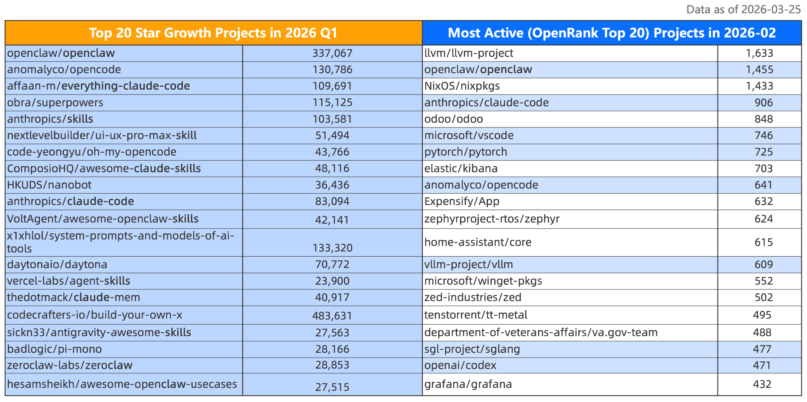

**Developer attention has completely flowed toward the Agent ecosystem**, although the Star count list includes many awesome-collection type projects (which naturally attract more attention). Just looking at the project names, you can feel they're permutations of a few words: OpenClaw, Skills, Claude, Claude Skills, OpenClaw Skills. The actual developer effort reflected in activity metrics is somewhat more honest, but even so, LLM-related projects account for about 40%.

Expanding the scope to the top 1000 most-watched repositories, after rough labeling, we can see 81% are Agent-related. The most frequently tagged keywords in project Topics are: **Agent, Claude, LLM, Code, Skill**.

Looking back over the past few years, you can feel the rotation of technological ecosystem dominance from the naming of popular projects emerging at different stages. Popular projects created around 2023-2024 were mostly related to **GPT** and **Llama**, such as AutoGPT, MetaGPT, Ollama, llama.cpp. As time turns, there are always technologies that serve as unavoidable coordinates. In 2025, that coordinate was called **Claude Code**, and thus projects like Clawdbot (later OpenClaw) and Claude-Mem emerged.

Based on the currently most popular and active projects, we've compiled the latest map of the Agentic AI ecosystem, covering about 50+ projects. Many should look familiar, while some are new faces. Let's follow a few specific projects to examine current technical trends.

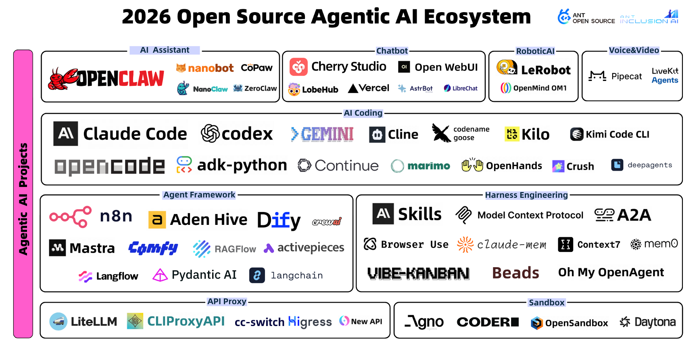

---

## Technical Trends from Popular Projects

### From Context Management to Complexity Harness

The optimizations we made under the capability constraints of the foundation models were essentially about managing information in the model's attention window: feeding more effective prompts to the model, invoking tools like browsers, connecting external background knowledge the model needs (RAG), and maintaining memory across multi-turn conversations. This path accumulated into a practice called "**Context Engineering.**"

**Claude-Mem** and **Context7** are two open-source tools created around mid-last-year, each now with tens of thousands of Stars. They each found interesting entry points, but essentially solve the same thing: telling the model more effective background knowledge—and making sure it doesn't forget.

> **Claude-Mem** is a Claude Code plugin that compresses all conversation outputs during Claude Code's task execution using a model, providing them as context for future conversations to ensure the Coding Agent has longer conversation memory.
>
> **Context7** provides both MCP service and Skill loading modes. Every time a task is executed, it fetches the latest documentation of involved dependency libraries to ensure the Coding Agent doesn't execute outdated code.

But "Context Engineering" as a term is starting to feel insufficient this year, because the problem is no longer just "is there enough information," but "will the Agent lose control?" Developers have likely experienced this: during autonomous task execution, the Agent either crashes the entire system or stops halfway without saying anything.

> **Oh-My-OpenAgent** (formerly oh-my-opencode, a plugin for OpenCode) calls itself the "strongest Agent Harness" in its project description. It built a continuous execution Enforcer called "Sisyphus": as long as TODO tasks aren't complete, it forces the Agent to keep restarting or finding new paths until 100% achievement—like Sisyphus endlessly pushing the stone up the mountain.

So I understand Harness as providing background knowledge while further constraining the Agent's behavioral boundaries—not just letting the Agent know "what is," but making clear "what it can touch" and "what it can't," and knowing what to do when stuck. Context Engineering manages input quality; Harness Engineering manages **execution discipline**.

---

### Software Development Shifts from Human-Centric to Agent-Centric

This trend can already be felt from the projects above: these newly emerging tools are designed not to serve developers, but with the Agent as the execution subject. Interestingly, what humans have accumulated in software development practices is now migrating to Agents. Developers need to consult the latest documentation—so do Agents; developers need to collaborate in teams—Agents are starting to need that too.

> **Vibe-Kanban** brings traditional task boards to the Agent team collaboration scenario, turning it into the Agent's command center. Each task creates an entry with clear acceptance criteria (AC) on the board. Agents execute against AC, while human engineers do task preview and Diff Review through an integrated UI. This is essentially a Harness too—just constraining not individual Agent execution behavior, but the entire development process.

A fitting analogy: model-driven code generation is a powerful but directionless horse; Harness is the equipment composed of constraints, guardrails, and feedback mechanisms; humans are riders, responsible for giving direction, not running themselves.

---

### The Agent "Evolution" Proposition—Lobsters, Cats, and Bees

Agents are clearly no longer satisfied with fixed process orchestration—self-evolution is the new proposition. OpenClaw started the "raising lobsters" trend first, and soon a new batch of cats and lobsters appeared. These projects, inspired by OpenClaw, each made tradeoffs in different dimensions.

> **nanoclaw** was launched in late January 2026 by indie developer Cohen, built entirely on Anthropic Claude Agent SDK with a core engine of about 4000 lines of code. Its design philosophy is security-first—all Agents run in isolated containers, using Apple Container on macOS and Docker on Linux, with Bash commands running in containers rather than on the host machine. Andrej Karpathy specifically mentioned it on social media: "The codebase is small enough that both I and AI can understand it, so it feels manageable, auditable, and flexible." This sentence precisely captures what this batch of lightweight frameworks is betting on: understandability itself is a security guarantee.

> **nanobot** goes even more extreme. From HKU's Data Intelligence Lab (HKUDS), about 4000 lines of Python code—99% less than OpenClaw. It strips away all non-core modules, keeping only the ReAct reasoning loop, tool calling, and message queue. It even removed the litellm external dependency in subsequent versions, switching to native SDK for direct model connection—the shorter the supply chain, the smaller the risk.

> **CoPaw** takes the opposite approach. Open-sourced by Alibaba Cloud's AgentScope team, it takes the feature-complete route. Built-in active heartbeat mechanism—not just passively responding to user messages, but proactively triggering tasks at set times. Memory is stored locally, with user preferences and historical tasks continuously accumulating. Supports DingTalk, Feishu, Discord, iMessage, and other channels, with a continuously expanding Skills ecosystem. If nanoclaw and nanobot are doing subtraction, CoPaw is seriously answering "what a complete personal AI assistant should look like."

Early this year, another open-source framework named Aden Hive appeared, answering a deeper question: **Can the orchestration framework itself self-evolve?**

The fundamental difference from traditional frameworks like LangChain and AutoGPT isn't in functionality, but in that it doesn't require developers to predefine agent execution flows. Its approach: describe goals in natural language, have a Coding Agent (Queen Bee) generate the Agent execution graph and connection code; once running, if failures occur, the framework captures failure data and calls the Coding Agent again to analyze causes, modify structure, and redeploy. This closed loop requires no human intervention. This is a serious bet on generative orchestration. It bets that task complexity often can't be predefined—rather than exhaustively enumerating all cases at design time, let the system continuously grow from feedback during real execution.

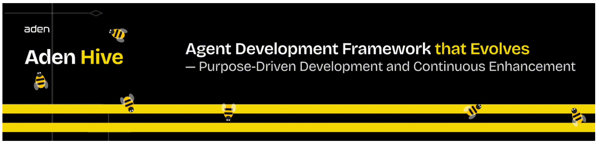

Whether Agents as personal assistants or Agent orchestration frameworks themselves, **self-evolution is transitioning from a bonus feature to a design starting point.**

---

### Model "Big Three" Each Build Complete Ecosystem Tools

The top model companies are each laying out their open-source ecosystem tools and standards. Anthropic is naturally the leader, both setting trends and establishing standards. MCP, Skills, Agents.md—one after another they land, and third-party tools can barely keep up digesting them.

An interesting phenomenon is the **blurring boundary between Coding Agent and General Agent**. After ChatGPT appeared, people searched for a long time before finding viable landing scenarios beyond Chatbot—Coding was among the first to be validated. But when tools like Claude Code reach a certain level, they naturally expand outward, not wanting to just be code-writing tools. OpenClaw was born under this expectation—using the IM window people are most familiar with as a carrier, attempting to carry more general Agent capabilities.

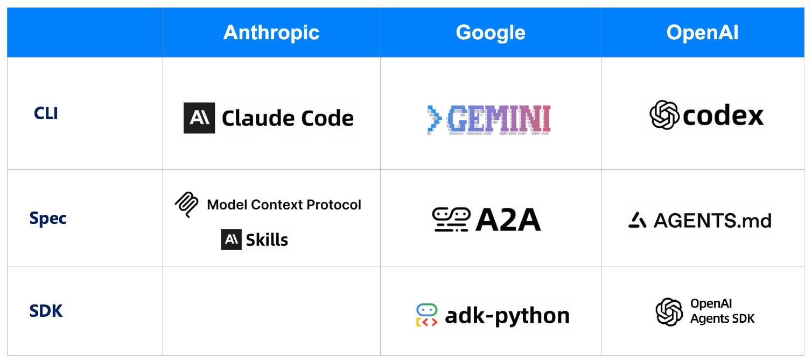

---

### Project Story: One-Person Company? Zero-Person Company!

Just as the OPC (One Person Company) concept was being hotly discussed, a project called Paperclip that appeared in early March has pushed this further. The concept it's hyping: **Zero-Person Company**. In just over 20 days, Stars grew from 0 to 40,000.

Paperclip's positioning is very direct:

> "If OpenClaw is an employee, Paperclip is the company."

Its usage logic has three steps: set goals, recruit a team, press start.

The goal could be "grow this AI note-taking app to $1M monthly revenue"; the team could be Claude as CEO, Cursor as CTO, Codex for engineering, OpenClaw for marketing; once started, this company begins running itself.

Even more interesting is its governance design. Agents can't hire new Agents themselves—this needs your approval; CEO can't unilaterally execute strategies—needs your confirmation. Paperclip positions you as the board—you can pause, override, reassign, or terminate any Agent at any time. **Autonomy is a privilege you grant, not an Agent's default power.**

In the OPC era, one person can do many things. But the question Paperclip is asking: if even that "one person's" execution work can be outsourced to Agents, what role remains for you? Probably just one word: **Board**.

---

## The AI Era's "Developers and AI"

Having covered projects, let's look at the other side: the people behind these projects.

### Developers: Concentrated in Head Projects, But from Diverse Backgrounds

In February 2026, across the top 50+ Agentic projects, there were approximately 21,000 independently active developers. But the “21,000” figure is somewhat misleading, because they are not evenly distributed across these projects: active developers in **OpenClaw** and **Claude Code** alone account for nearly half of the total.

    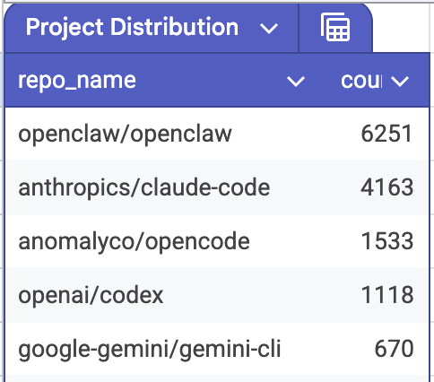
    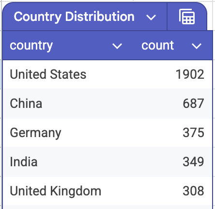
    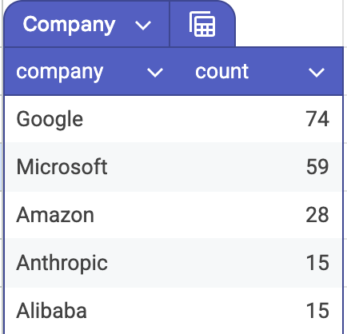

Activity distribution is similarly highly concentrated. This is the familiar power law phenomenon in open-source communities, but it's particularly extreme in this ecosystem: top developer activity scores reach 81, while 95% of developers have activity under 1—a minority driving most substantive progress.

There are several noteworthy numbers in these developers' background composition. Among the 4,232 developers who filled in company information, those from big companies like FAANG and BAT account for less than 10%. More are independent developers and startup people—this ecosystem is not currently dominated by big company engineers.

Geographically, among the 6,295 developers who filled in country information, US developers account for 30%—three times the Chinese developers. Given that Agentic tools currently rely heavily on Claude-series models, this gap has structural reasons, but it also means the Chinese community's voice in this ecosystem is currently weak.

---

### Developers: Young and Cross-Disciplinary, "Builders," "Founders," and "Digital Nomads"

We focused on the top 100 most active developers. They're significantly younger, or at least arrived at the developer community later—the median account creation time is January 2018. If you include long-tail developers, the median becomes December 2013. These two numbers together tell us one thing: **a significant portion of top active contributors entered the developer community after the Kubernetes era**, and their technical intuition and infrastructure cognition differ noticeably from cloud-native veterans.

Even more extreme: among the 100, one-quarter (25 developers) registered GitHub after 2023, meaning they started coding only after LLMs truly went mainstream. **ComfyUI** author comfyanonymous and **Aden Hive** author RichardTang-Aden are among them. They're not developers "changed" by the AI wave—they're developers "summoned" by it. Before this, they might not have considered themselves developers at all.

Here are several representative developers. In their self-descriptions, they are designers, musicians, self-taught developers, prompt engineers, hackers, and digital nomads. Their commonality isn't technical background—it's that verb: **build**.

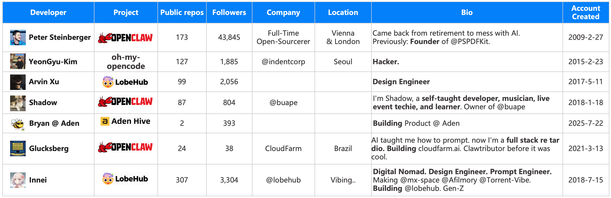

---

### Developers and AI: Replacement or Symbiosis? Let's Look at the Numbers

This question is hard to answer directly, but numbers can provide clues. Searching GitHub for Claude-attributed Commits yields over 20 million results. Using the same search method: Cursor about 1 million, Copilot 700K, Gemini 450K, Codex even lower. The difference between Claude and others is a full order of magnitude.

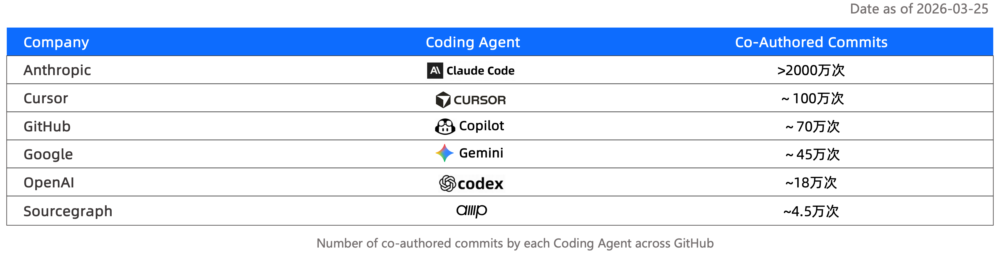

Of course, this data has obvious limitations—this is fuzzy search, and many AI-participated Commits won't be attributed at all, and attribution habits vary by tool and team culture. But even discounting, this order-of-magnitude difference still tells us one thing: Claude-series tools are embedded quite deeply in actual code submission pipelines.

Beyond code generation, Review is another link being taken over by Agents. **Copilot** and **CodeRabbit** have completed **hundreds of thousands of code Reviews in less than three months this year**. The significance of this number isn't just scale, but that Review was previously considered highly dependent on human judgment—it requires understanding context, intent, and team norms. How well Agents can do this is still hard to determine, but they're already doing it.

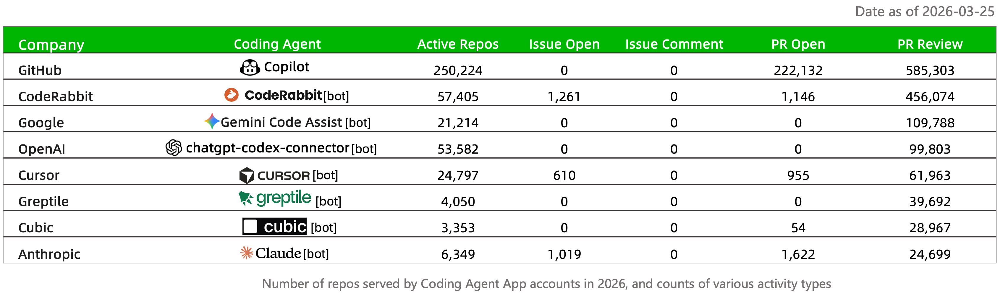

Last week, news spread that OpenAI shut down the Sora application. External speculation generally suggests they're contracting to focus on Codex and other Coding directions. The logic behind this judgment isn't hard to understand: among all Agent landing scenarios, Coding is one of the few that has truly completed commercial validation. **Other scenarios are still telling stories; Coding Agents are already collecting money.**

---

### 2026 Coding Agent Landscape: Prompting, Generation, Review, to Requirements Management

We've compiled a landscape of currently popular Coding Agents. The code completion stage represented by Copilot is basically past tense—though Copilot is still holding on. While it can't match Claude at writing code, as GitHub's native AI collaboration tool, it's still leading in code review.

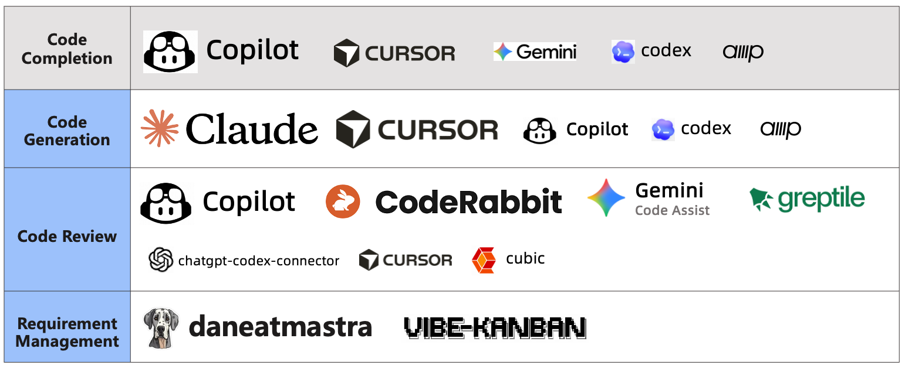

Due to time constraints, we didn't do deeper research this time. There's an interesting question: do PRs using Review Agents get merged significantly faster than those without? Intuitively yes, but "significantly" to what extent, and in what types of projects is it most obvious—this deserves serious data analysis.

The more interesting part of the landscape is that some projects are already exploring earlier stages of the software development lifecycle—requirements management. Besides the aforementioned Vibe Kanban, Dane in the Mastra project is another fascinating bot. It can connect to various community channels—Slack, Discord, or mailing lists—extract or abstract project requirements from discussions, and directly file Issues in repositories.

---

## Finally: Amidst AI FOMO, Openness, Sharing, and Collaboration Remain Developers' Spiritual Home

👆This sentence is a personal feeling written at the end.

Peter Steinberger is a tireless open-source builder and creator in the AI era. Before OpenClaw, he had already open-sourced 50+ projects. OpenClaw rekindled everyone's enthusiasm in this exhausted era, largely because it's an open-source project—not just spiritually, but because open-source means it can run locally, means data has some degree of privacy, means you can optimize or fork the project. Although many say OpenClaw, like last year's Manus, is just extreme shell-wrapping on top of model capability evolution, I think this alone makes it fundamentally different from Manus.

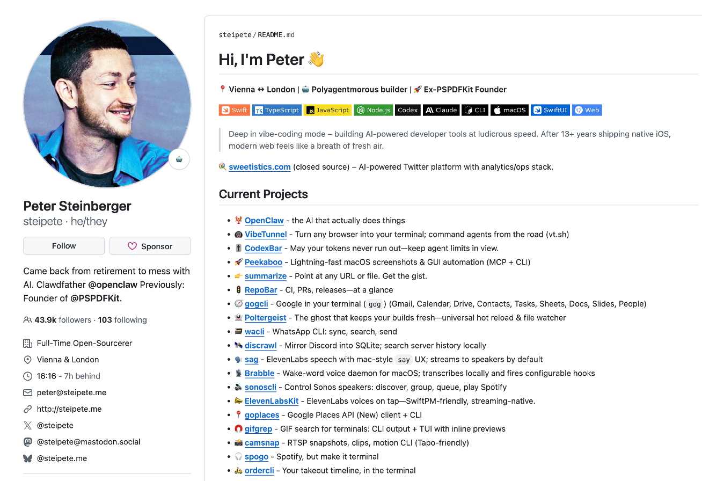

When OpenAI acquired OpenClaw, it immediately promised to ensure the project remains open-source and operates neutrally through a foundation. Whether this promise can be fulfilled remains to be verified over time. But the existence of the promise itself shows that open-source community demands have enough weight to force a commercial company to write them into the acquisition agreement.

Under the AI FOMO wave, models iterate, products iterate, funding iterates. But openness, sharing, and collaboration have never truly gone out of style in the developer community. This is perhaps one of the few things in this ecosystem that doesn't need to wait for "the next version."
